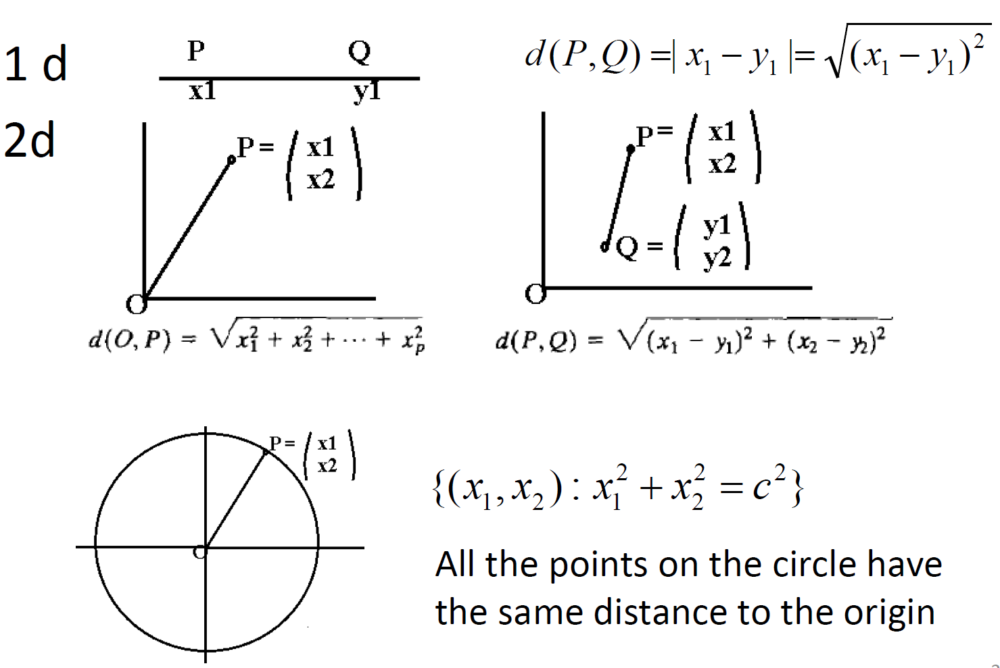

```{r setup, include=FALSE}
knitr::opts_chunk$set(echo = TRUE)
library(tidyr) #the pipe (%>%) tool is extremely useful
library(MASS)
```


# Intro
## Introduction

### Course Information
- Please use the Canvas website for course materials, important updates, and deadlines.
- Announcements will be sent to the mailing list or posted in Canvas.
- Assignment submission: GradeScope on Canvas.

### Multivriate Data
- "multi" means more than one 
- Multivariate data: the data with \textcolor{red}{simultaneous
measurements} on many variables
```{r echo=FALSE, out.width="50%"}
cover_url = 'https://upload.wikimedia.org/wikipedia/commons/thumb/c/c0/Wiki-grafik_peats-de_big_five_ENG.svg/1920px-Wiki-grafik_peats-de_big_five_ENG.svg.png'
if (!file.exists(cover_file <- 'img/personality.png'))
  download.file(cover_url, cover_file, mode = 'wb')
knitr::include_graphics(if (identical(knitr:::pandoc_to(), 'html')) cover_url else cover_file)
```

### More Examples of Multivariate Data
- A basketball player: points, rebounds, steals, assists, turnovers, free throws, fouls, etc
- A person’s well-being: social, economic, psychological, medical, physical, etc
- A person’s annual physical exam report

### What is Multivariate Analysis
* The term "multivariate analysis" implies a broader scope than univariate analysis.
* Certain approaches like simple linear regression and multiple regression are typically not considered as multivariate analysis as they tend to focus on the conditional distribution of one univariate variable rather than multiple variables.
* Multivariate analysis focuses on the joint behavior of several variables simultaneously to identify patterns and relationships

### Learning Objectives
- Matrix algebra, distributions
- Visualization
- Inference about a mean vector or multiple mean vectors
- Multivariate analysis of variance (MANOVA) and multivariate regression
- Linear discriminant analysis (LDA)
- Principal component analysis (PCA)
- Cluster analysis
- Factor analysis


### Milestones in the history of multivariate analysis
- 1901: PCA was invented by Karl Pearson; independently developed by Harold Hotelling in the 1930s.
- 1904: Charles Spearman introduced factor analysis to identify underlying factors that explain the correlation between multiple variables.
- 1928: Wishart presented the distribution of the covariance matrix of a random sample from a multivariate normal distribution.
- 1936: Ronald Fisher developed discriminant analysis.
- ????: Cluster analysis.
- 1936: Canonical analysis by Harold Hotelling.
- 1960s: Multidimensional scaling.
- 1970s: Multivariate regression.
- 1980s: Structural equation modeling; the idea dated back to (1920-1921) by Sewall Wright.

# Matrix Algebra
## Vectors: We begin with a little bit matrix algebra
### Vectors in R
- There are many ways to create or define a vector
```{r}
x=rep(0.3, 4)
x
x=seq(1, 4, by=0.2)
x
c("a1", "a2", "a3")
```

### Vectors in R
```{r}
x=c(0.4, 0.2, 0.5)
x
length(x)
dim(x) #note that there is no dimension information
```

### A row or column of a matrix is also a vector
```{r}
x=rbind(c(0.4,0.2,0.5), rep(1,3))
dim(x)
x[1,]
x[,1]
```

## Special Matrices
### Row or Column Vectors
- A vector (column vector) is a special matrix consisting of a single column of elements. e.g.,
$$a=\begin{pmatrix}a_1\\ a_2 \\ a_3\end{pmatrix}$$
- A row vector is a special matrix consisting of a single row of elements
$$b=(b_1, b_2, b_3, b_4)$$
- In this class, a vector means a column vector
- A row or column vector is also a matrix
- The transpose of a row vector is a column vector; the transpose of a column vector is row vector. e.g.,
$$a'=(a_1,a_2,a_3)$$

### Row or Column Vectors
- In vector/matrix operations, it is helpful to define row or column vectors
- A row vector
```{r}
matrix(rep(0.5,3), 1, 3)
dim(matrix(rep(0.5,3), 1, 3))
#A neater way is to use the pipe "%>%"
matrix(rep(0.5,3), 1, 3) %>% dim
```

### Row or Column Vectors
- A column vector
```{r}
x= matrix(rep(0.5,3), 3, 1)
dim(x)
# use pipe
x %>% dim
```

### Transposes
- The transpose of a column vector is a row vector
- The transpose of a row vector is a column vector
```{r}
x= matrix(rep(0.5,3), 3, 1)
x
t(x)
```

### Types of Special Matrices
- Identity matrix
- Diagonal matrix
- All-ones matrix
- Random matrix: a matrix whose entries are random variables. I will introduce matrix normal distributions. 

### Identity Matrix
```{r}
#diag(1, 2)
diag(5, 3)
diag(1, 2, 3)
```
### Diagonal Matrix
```{r}
diag(1:3)
seq(1,2, by=0.5) %>% diag
```

### All-ones
```{r}
matrix(1, 3, 2)
```
## Common Vector Operations

### Scalar Multiplication
```{r echo=FALSE, out.width="60%"}

```

### Examples of Scalar Multiplication
```{r}
x=matrix(c(0.4,0.2,0.5), 3, 1)
10*x
```

### Addition and Substraction
```{r echo=FALSE, out.width="70%"}

```

### Example of Addition and Substraction
```{r}
x1=matrix(c(0.4,0.2,0.5), 3, 1)
x2=rep(1, 3)
x1+x2
x1-x2
```


### Outer Product
- The outer product of two vectors $x=(x_1,\cdots, x_m)'$ and $y=(y_1,\cdots,y_n)'$ is
$$x\otimes y= \begin{pmatrix}
x_1y_1 & x_1y_2 & \cdots & x_1y_n\\
\cdots& \cdots& \cdots& \cdots \\
x_my_1 & x_my_2 & \cdots & x_my_n
\end{pmatrix}$$
- A similar operation for matrices is called Kronecker product.


### Example: outer product
```{r}
x1=matrix(c(0.4,0.2,0.5), 3, 1)
x2=rep(1, 3)
x1%*%x2
```

### Inner product
- Let 
$x=\begin{pmatrix}x_1\\ \cdots\\  x_n\end{pmatrix}, y=\begin{pmatrix}y_1\\ \cdots\\ y_n\end{pmatrix}$
The inner product of $x$ and $y$ is 
$$<x,y>=x_1y_1 + \cdots x_ky_n=\sum_{i=1}^n x_iy_i$$
- Note, the two vectors must have the same length
- The norm / Euclidean norm / length of $x$ is $||x||=\sqrt{<x,x>}$
- The Euclidean distance between $x$ and $y$ is
$$D(x,y)=||x-y||=\sqrt{(x_1-y_1)^2 + \cdots (x_k-y_k)^2}$$

### Inner Product and Norm
```{r echo=FALSE, out.width="70%"}

```

### Distance: 1d and 2d
```{r echo=FALSE, out.width="70%"}

```

### Distance: 3d
```{r echo=FALSE, out.width="80%"}

```

### Example: Norm
```{r}
x1=matrix(c(0.4,0.2,0.5), 3, 1)
#the norm/length of x1
sqrt(sum(x1^2))
#or use pipe
x1^2 %>% sum %>% sqrt
```

### Example: (Euclidean) Distance
```{r}
x1=matrix(c(0.4,0.2,0.5), 3, 1)
x2=rep(1, 3)
sqrt(sum((x1-x2)^2))
#or use pipe
(x1-x2)^2 %>% sum %>% sqrt
```


### Example: (Euclidean) Distance
- Motivating example. Consider bivariate random vectors. The standard deviations are 2 and 1, respectively. 
- What is the distance between (-2,0) and (2,0)? \textcolor{red}{4}.
- What is the distance between (0, -2) and (0,2)? \textcolor{green}{4}.
```{r, out.width="60%", echo=FALSE}
set.seed(20230404)
par(pty="s")
mvrnorm(n=1000, c(0,0), matrix(c(4,0,0,1),2,2)) %>% 
  plot(xlab="x", ylab="y", xlim=c(-4,4), ylim=c(-4,4))
points(x=c(-2, 0, 0, 2), y=c(0, -2, 2, 0), pch=15, col=c(2,3,3,2),cex=3)
```

### Example: (Euclidean) Distance
```{r, eval=FALSE}
#R code
set.seed(20230404)
par(pty="s")#to make sure the shape of figure is a square
mvrnorm(n=1000, c(0,0), matrix(c(4,0,0,1),2,2)) %>% 
  plot(xlab="x", ylab="y", xlim=c(-4,4), ylim=c(-4,4))
points(x=c(-2, 0, 0, 2), y=c(0, -2, 2, 0), pch=15, 
       col=c(2,3,3,2),cex=3)
```
* Both pairs have a distance of 4. 
* But we notice that the pairs with a y-distance greater than 4 is very rare; as a comparison, there are much pairs with a x-distance greater than 4. 

### A Homework Problem of Euclidean Distances
* Suppose $X_1, X_2, Y_1, Y_2$ are mutually independent.
    + $X_1$ and $X_2$ are iid from $N(\mu=0, \sigma_x^2=2^2)$
    + $Y_1$ and $Y_2$ are iid from $N(\mu=0, \sigma_y^2=1^2)$
Consider the two pairs $(X_1, X_2)$ and $(Y_1, Y_2)$. Which pair tends to have a larger difference? To answer the question, please calculate and estimate the following two probabilities:
$$P(|X_1-X_2|>4), P(|Y_1-Y_2|>4)$$
* The hints for calculating/estimating $P(|X_1-X_2|>4)$ can be found in the two slides. Using similar strategies, you can calculate/estimate $P(|Y_1-Y_2|>4)$

### Calculate $P(|X_1-X_2|>4)$
* Hints for calculating $P(|X_1-X_2|>4)$. 
    + First find the distribution of $X_1-X_2$. Then standard it to have mean 0 and SD 1. 
    + Second, express the probability to $P(|Z|>z)$, where $Z\sim N(0,1)$. 
    + Next, expression the probability in terms of $\Phi(\cdot)$, the CDF of the standard normal distribution. 
    + Last, use the "pnorm" function in R to find the numerical value. 

### Estimate $P(|X_1-X_2|>4)$
* The probability can be estimated by doing simulations/sampling. 
* If you sample many (say 10,000) pairs of $X_1$ and $X_2$, count how many pairs satisfying $|X_1-X_2|>4$. The probability can be used to estimate $P(|X_1-X_2|>4)$


### Statistical / Mahalanobis Distance
* The two probabilities are quite different, suggesting that the Euclidean distance might be misleading given the joint distribution of the variable. 
* In this example we have examined, the x-values and y-values are independent. * The variation along $x$ is greater than along $y$. Let $X_1$ and $X_2$ be two random points along the $x$ direction, $Y_1$ and $Y_2$ be two random points along the $y$ direction.  
* One simple idea is to standardize both. Because the SD of Y is 1 we don't need to change the y-values. Because the SD of X is 2, we shrink the x-values by 50%.
    + point (-2,0) becomes (-1,0)
    + point (2, 0) becomes (1,0)
* The distance between the red pair is 2, the distance between the green pair is 4. 

### Standardized Observations
```{r, out.width="60%", echo=FALSE}
set.seed(20230404)
par(pty="s")
simdata=mvrnorm(n=1000, c(0,0), matrix(c(4,0,0,1),2,2)) 
simdata[,1]=simdata[,1]/2
plot(simdata,xlab="x", ylab="y", xlim=c(-4,4), 
     ylim=c(-4,4))
points(x=c(-2, 0, 0, 2), y=c(0, -2, 2, 0), pch=15, 
       col=c(2,3,3,2),cex=3)
```

### Standardized Observations 
```{r, out.width="60%", echo=FALSE}
set.seed(20230404)
par(pty="s")
mvrnorm(n=1000, c(0,0), matrix(c(4,0,0,1),2,2)) %>% 
  plot(xlab="x", ylab="y", xlim=c(-4,4), ylim=c(-4,4))
points(x=c(-2, 0, 0, 2), y=c(0, -2, 2, 0), pch=15, col=c(2,3,3,2))
```


### Statistical Distance
- In The example above $X$ and $Y$ are independent, as a result, the covariance is zero. Statistical distance can also be defined when the covriance matrix $\Sigma$ is not diagonal;
- We will introduce a type of statistical distance, which is known as Mahalanobis distance. 

```{r echo=FALSE, out.width="60%"}

```

<!--
## Orthogonal Vectors
### The Angle Between Two Vectors
- Let $x$ and $y$ be two vectors of the same length. Say $x\in \mathbf R^k$ and $y\in \mathbf R^k$.
- Let $\theta$ be the angle between the two vectors. Then
$$cos(\theta)=\frac{}{}$$
### Project One Vector on Another
- Let $x$ and $y$ be two vectors of the same length. Say both $x$ and $y$ are in $\mathbf R^k$.
- The direction of $proj_x(y)$ is the same as that of $x$. 
- The length of the projection is $||y|| cos(\theta)$. 
- The projection of $y$ on $x$ is 


### Example: Projection
```{r}
# Define the vectors
y <- c(3, 3)
x <- c(6, 1.4)

# Compute the projection of v1 onto v2
proj <- sum(y * x) / sum(x * x) * x

# Create a plot
par(pty="s")
plot(0, 0, xlim = c(-1, 7), ylim = c(-1, 7), type = "n", xlab = " ", ylab = " ")
abline(h = 0, v = 0)
text(y[1], y[2], "y", pos = 3)
text(x[1], x[2], "x", pos = 3)
text(proj[1], proj[2]+0.5, expression(proj[x](y)), pos = 3)
segments(0, 0, y[1], y[2], lty = "dotted")
segments(0, 0, x[1], x[2], lty = "dotted")
segments(y[1], y[2], proj[1], proj[2], lty = "dotted", col = "red")
segments(0, 0, proj[1], proj[2], lty = "dotted", col = "red")

```
-->


