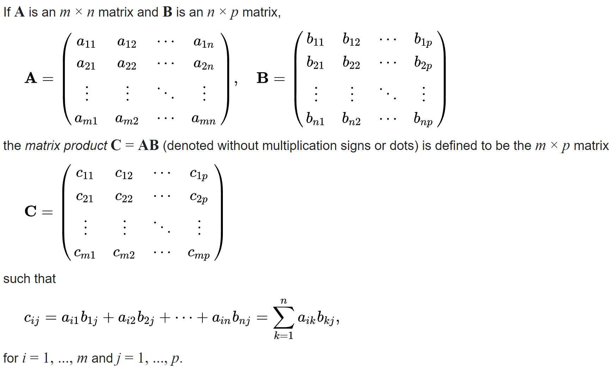
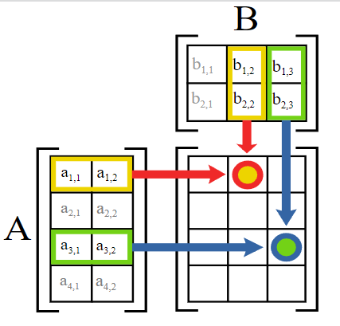
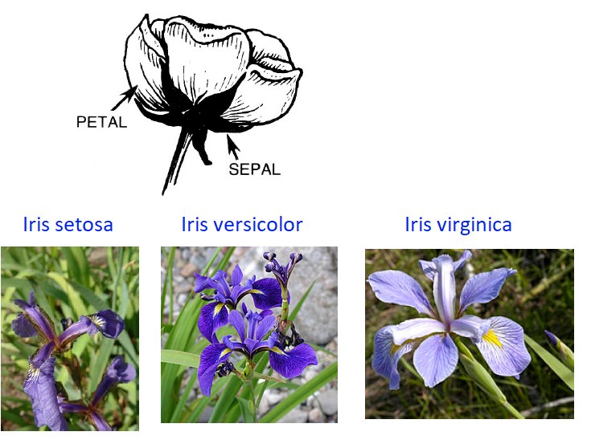
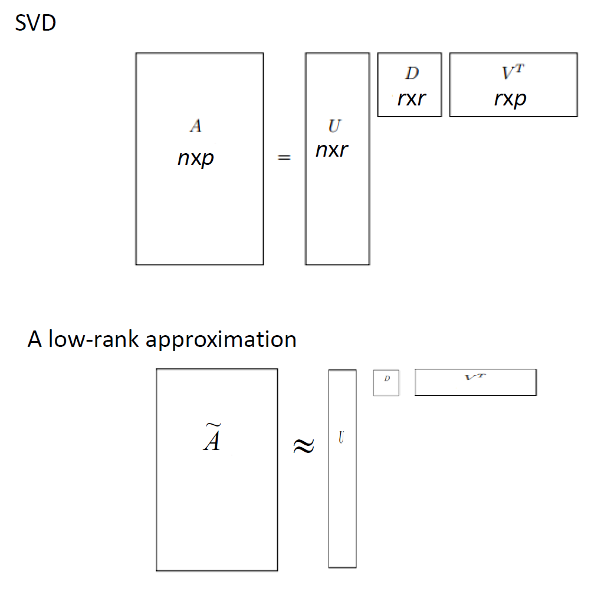
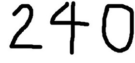
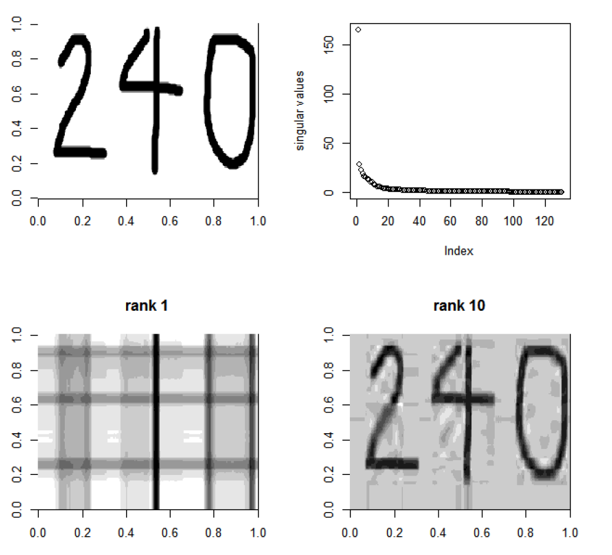
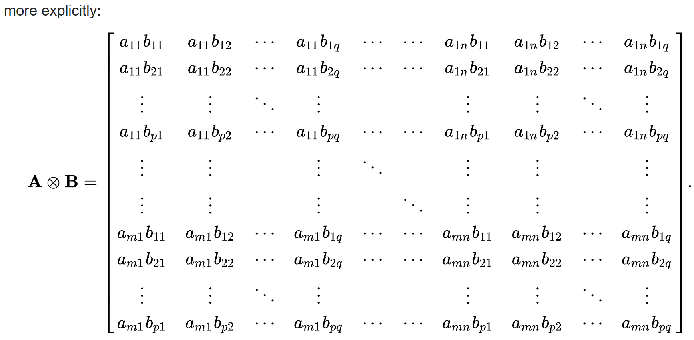

```{r setup, include=FALSE}
knitr::opts_chunk$set(echo = TRUE)
library(tidyr) #the pipe (%>%) tool is extremely useful
library(MASS)
```


## Matrix Multiplication

### Definition of Matrix Multiplication
- Consider matrix $A_{m\times n}$ and matrix $B_{n\times p}$.
- How does $AB$ look like?
- $AB$ has $m$ rows and $p$ columns
- What is the value in the $i$th row and $j$th column of $AB$? We often denote it as the $(i,j)$th element/entry of $AB$:
$$\left(AB\right)_{i,j}=\sum_{k=1}^n a_{ik}b_{kj}$$


### Definition of Matrix Multiplication
```{r echo=FALSE, out.width="90%"}

```

### Matrix Multiplication
```{r echo=FALSE, out.width="50%"}

```

### Conformable Matrices 
- Conformability refers to whether two matrices can be multiplied.  
- Two matrices can be multiplied if they are \textcolor{red}{conformable}.  
- E.g., if $dim(A)=n\times 10, dim(B)=10\times p$, then $A$ and $B$ are conformable because we can compute $AB$. 
- Note: If $A$ and $B$ is conformable for calculating $AB$, it doesn't guarantee that they are also conformable for calculating $BA$. 
- conformable for multiplication, then the operation is not defined. 


## The Iris Data

### Iris data
* Three species of iris flowers: setosa, versicolor, and virginica
* Four features: sepal length, sepal width, petal length, and petal width
```{r echo=FALSE, out.width="60%"}

```

### Introduction
* The iris dataset is a widely used dataset to illustrate various methods, algorithms, and problems. 
* Iris dataset serves as an excellent example of how data can be used to gain insights into different fields.
* It is available in many places
  + It is available from UCI Machine Learning Repository.  
  + It is also included as a built-in data set in R. Use "data()" to see the list of built-in data sets. 
  + Wikipedia has a page for the dataset.  
* Its simplicity and easy availability have made it a widely used dataset for educational and research purposes.


### History
* The iris dataset has a rich history and has been used in many different areas of research
* It was first introduced by Ronald Fisher in 1936. 
* The dataset contains measurements of four features of three species of iris flowers. 
* Fisher used the iris dataset as an example of discriminant analysis

### Iris data
```{r echo=FALSE, out.width="70%"}

```

### Iris data in R
* The iris data is stored in two different formats: 
  + as a 3D array: iris3
  + as a long matrix: iris
```{r}
#?iris
dim(iris3)
dim(iris)
```
### Iris data in R
```{r}
dimnames(iris3)
names(iris)
```

### Iris data in R
```{r}
#the attributes is a useful function to understand data
attributes(iris3)
```

### Iris data in R
```{r}
#the attributes is a useful function to understand data
attributes(iris)
```

### Heatmap of the Iris Data
```{r, out.width="50%",eval=FALSE}
Y=as.matrix(iris[, 1:4])
rownames(Y)=iris[,5]
heatmap(Y[150:1, ],col=rainbow(12),Rowv=NA, Colv=NA)
```

### Heatmap of the Iris Data
```{r, out.width="60%",echo=FALSE}
Y=as.matrix(iris[, 1:4])
rownames(Y)=iris[,5]
heatmap(Y[150:1, ],col=rainbow(12),Rowv=NA, Colv=NA)
```

### Left multiply a matrix to Y: Example 1
* Consider 
$$A=\frac{1}{150}\mathbf{1}_{1\times 150},$$
i.e.,
$$A_{1\times 150}=(\frac{1}{150}, \cdots, \frac{1}{150})$$
* What is $AY$?
* In R, the correct syntax for matrix multiplication is

```{}
%*%
```

### Left multiply a matrix to Y: Example 1
```{r}
A=matrix(1/150, 1, 150)
A%*%Y
dim(A%*%Y)
```

### Left multiply a matrix to Y: Example 1
* Let's check the results
```{r}
A%*%Y
colMeans(Y)
```

### Left multiply a matrix to Y: Example 2
* Let 
$$B=\frac{1}{50}\begin{pmatrix}
\mathbf 1_{1\times 50} & \mathbf 1_{1\times 50} & \mathbf 0_{1\times 50}\\
\mathbf 1_{1\times 50} & \mathbf 0_{1\times 50} & -\mathbf 1_{1\times 50} \\
\mathbf 0_{1\times 50} & \mathbf 1_{1\times 50} & -\mathbf 1_{1\times 50} \\
\end{pmatrix}$$
i.e.,
$$B=\begin{pmatrix}
\frac{1}{50}& \cdots& \frac{1}{50}&
-\frac{1}{50}& \cdots& -\frac{1}{50}&
0 & \cdots & 0\\
\frac{1}{50}& \cdots& \frac{1}{50}&
0 & \cdots & 0 &
-\frac{1}{50}& \cdots& -\frac{1}{50}&\\
0 & \cdots & 0 &
\frac{1}{50}& \cdots& \frac{1}{50}&
-\frac{1}{50}& \cdots& -\frac{1}{50}&
\end{pmatrix}$$

* What does $BY$ give us?

### Left multiply a matrix to Y: example2
* $BY$ gives the pairwise difference in group means for each feature
```{r}
B=1/50*rbind(
  rep(c(1,-1, 0), each=50), 
  rep(c(1, 0,-1), each=50), 
  rep(c(0, 1,-1), each=50))
B%*%Y
```

### Left multiply a matrix to Y: example2
* Let's check results
```{r,  out.width="60%"}
#colMeans(iris[iris$Species=="setosa",1:4])
colMeans(Y[1:50,])
colMeans(Y[51:100,])
colMeans(Y[100:150,])
```

### Right multiply a matrix to Y: convert cm to inch
* The lengths in the iris data were measured using cm
* 1cm = 0.393701inch. How to convert data to inch? 
* Let 
$$C=\begin{pmatrix} 
0.393701 & 0 & 0 & 0\\
0 & 0.393701 & 0 & 0\\
0 & 0 & 0.393701 & 0\\
0 & 0 & 0 & 0.393701
\end{pmatrix}$$
* $YC$ is the data in inch. 

### Right multiply a matrix to Y: convert cm to inch
```{r}
C=diag(0.393701, 4, 4)
Y%*%C
```

### A homework problem: 
* Find a matrix $A$ such that $AY$ gives the difference of means vectors between iris setosa and iris versicolor
* Find a matrix $B$ such that $YB$ is column-standardized, i.e., the standard deviation of each column/feature is 1. 
* Check the following
  + Let $C=\mathbf I_{150} - \frac{1}{150}J$, where $J_{150\times 150}$ is an all-ones matrices . Use R to verify that $CY$ centers each column/feature. The R code for $C$ is "
```{}  
C=diag(1,150) - \frac{150}matrix(1, 150, 150)
```
  + Let $S$ be the sample covariance matrix. Use R to verify that each column of $CYS^{-1/2}$ has been centered and standardized. Hints:
  ```{}
  S=cov(Y)
  ```
To compute $S^{-1/2}$, you may need a R package, such as "qtl2pleio".

## Singular Value Decomposition (SVD)

### Introduction to SVD
* SVD was developed by a number of researchers independently over time. Key contributors
  + Eugenio Beltrami (1873): an Italian mathematician, first introduced the concept of singular value decomposition in his work on mathematical physics, although the modern formulation of SVD was not fully realized at that time. 
  
  + Camille Jordan (1874), a French mathematician, independently discovered it. 
  
  + ... Many other contributors ...
  
  + Gene H. Golub and Charles F. Van Loan (1965): American mathematicians, are credited with the development of the modern and widely used algorithm for computing the singular value decomposition, known as the Golub-Reinsch algorithm.

### What is SVD?
* SVD is a useful factorization of a rectangular matrix A into three matrices
* If $A$ is an $n\times p$ matrix of rank $r$,then A can be written as 
$$A_{n\times p} = U_{n\times r} D_{r\times r} V_{r\times p}^T$$
where
  + $U_{n\times r}$ and $V_{r\times p}$ are column orthogonal matrices, i.e., 
  $$U^TU=V^TV=\mathbf I_{r}$$
  + $U$ is the left singular vectors matrix, contains the eigenvectors of $AA^T$ (n x n matrix)
  + V^T is right singular vectors matrix, contains the eigenvectors of $A^TA$ (p x p matrix)
  + $D$ is diagonal matrix of singular values, contains the square root of the eigenvalues of $AA^T$ and $AA^T$

### Intuition behind SVD
* SVD helps us understand the linear transformation of a matrix in terms of its components: rotation, scaling, and reflection.
* $U$ and $V^T$ represent rotations in the input and output spaces respectively, while $D$ represents scaling along the axes.
* SVD allows us to find a lower-dimensional representation of the data by capturing the most important singular values and their corresponding singular vectors.
* SVD can be used for various applications such as image compression, recommendation systems, and data analysis.
  + Image Compression: SVD can be used to reduce the size of an image by compressing it while retaining its important features.
  + Recommendation Systems: SVD can be used to make personalized recommendations in recommendation systems by factorizing user-item interaction matrices.
  + Data Analysis: SVD can be used for dimension reduction, noise reduction, and feature extraction in data analysis tasks such as clustering, classification, and regression.
  
### SVD can be used for image compression 
```{r echo=FALSE, out.width="60%"}

```

### SVD: Example 1
*The original image
```{r echo=FALSE, out.width="60%"}

```

### SVD: Example 1
*The original image
```{r echo=FALSE, out.width="60%"}

```

### SVD: Example 1
```{r}
#install and load "jpeg"
library(jpeg)
mydata=readJPEG("img/svdexample.jpg", native = FALSE)
mydata=mydata[,,1] #279-by-131
obj=svd(mydata)
#obj$u: a 279-by-131 matrix
#obj$d: a vector of 131 nonnegative values
#obj$v: a 131-by-131 matrix
```

### SVD Example 1: R 
```{r, eval=FALSE}
par(mfrow=c(2,2))
image(mydata,col=gray(c(0:10)/10))

plot(obj$d, ylab="singular values")

n=1
mydata.approx=obj$u[,1] %*% t(obj$v[,1])*obj$d[1]
image(mydata.approx, main="rank 1", col=gray(c(0:10)/10))

n=10
mydata.approx=obj$u[,1:n]%*% diag(obj$d[1:n]) %*% t(obj$v[,1:n])
image(mydata.approx, main="rank 10", col=gray(c(0:10)/10))
```

### SVD Example 1: R 
```{r, echo=FALSE}
par(mfrow=c(2,2))
image(mydata,col=gray(c(0:10)/10))

plot(obj$d, ylab="singular values")

n=1
mydata.approx=obj$u[,1] %*% t(obj$v[,1])*obj$d[1]
image(mydata.approx, main="rank 1", col=gray(c(0:10)/10))

n=10
mydata.approx=obj$u[,1:n]%*% diag(obj$d[1:n]) %*% t(obj$v[,1:n])
image(mydata.approx, main="rank 10", col=gray(c(0:10)/10))
```

### SVD: Example 2
```{r, eval=FALSE}
BikeMan=readJPEG("BikeMan.jpg", native = FALSE)
BikeMan=BikeMan[,,1]

par(mfrow=c(2,2))
image(BikeMan, col=gray(c(0:10)/10))
obj.bm=svd(BikeMan)

n=10
BikeMan.approx=obj.bm$u[,1:n]%*% diag(obj.bm$d[1:n]) %*% t(obj.bm$v[,1:n])
image(BikeMan.approx, main="rank 10", col=gray(c(0:10)/10))

n=20
BikeMan.approx=obj.bm$u[,1:n]%*% diag(obj.bm$d[1:n]) %*% t(obj.bm$v[,1:n])
image(BikeMan.approx, main="rank 20", col=gray(c(0:10)/10))

n=30
BikeMan.approx=obj.bm$u[,1:n]%*% diag(obj.bm$d[1:n]) %*% t(obj.bm$v[,1:n])
image(BikeMan.approx, main="rank 30", col=gray(c(0:10)/10))
```

### SVD: Example 2
```{r, echo=FALSE}
BikeMan=readJPEG("img/BikeMan.jpg", native = FALSE)
BikeMan=BikeMan[,,1]

par(mfrow=c(2,2))
image(BikeMan, col=gray(c(0:10)/10))
obj.bm=svd(BikeMan)

n=10
BikeMan.approx=obj.bm$u[,1:n]%*% diag(obj.bm$d[1:n]) %*% t(obj.bm$v[,1:n])
image(BikeMan.approx, main="rank 10", col=gray(c(0:10)/10))

n=20
BikeMan.approx=obj.bm$u[,1:n]%*% diag(obj.bm$d[1:n]) %*% t(obj.bm$v[,1:n])
image(BikeMan.approx, main="rank 20", col=gray(c(0:10)/10))

n=30
BikeMan.approx=obj.bm$u[,1:n]%*% diag(obj.bm$d[1:n]) %*% t(obj.bm$v[,1:n])
image(BikeMan.approx, main="rank 30", col=gray(c(0:10)/10))
```

## Another Matrix Operation: Kronecker Product
### Definition
* The Kronecker product, denoted by $\bigotimes$ is a mathematical operation that combines two matrices to create a larger matrix.
* \textcolor{pink}{It is named after the Danish mathematician Heinrich Kronecker, who introduced it in the late 19th century.} Chatgpt gives \textcolor{red}{wrong} information. 
* According to wikipedia, "The Kronecker product is named after the German mathematician Leopold Kronecker (1823–1891), even though there is little evidence that he was the first to define and use it. "
* Why is it useful? It provide compact Representation. Kronecker product allows for compact representation of large matrices by expressing them as a combination of smaller matrices.


### Definition
Let 
$$A_{m\times n}=\begin{pmatrix}
a_{11} & \cdots & a_{1n}\\
\cdots & \cdots & \cdots\\
a_{m1} & \cdots & a_{mn}\\
\end{pmatrix},
B_{p\times q}=\begin{pmatrix}
b_{11} & \cdots & b_{1q}\\
\cdots & \cdots & \cdots\\
b_{p1} & \cdots & b_{pq}\\
\end{pmatrix}$$
Then,
$$A \bigotimes B = 
\begin{pmatrix}
a_{11} * B & a_{12} * B & ... & a_{1n} * B \\
\cdots & \cdots & \cdots & \cdots\\
a_{m1} * B & a_{m2} * B & ... & a_{mn} * B 
\end{pmatrix}$$

### Definition
```{r echo=FALSE, out.width="80%"}

```

## Futher reading
* Chronecker product: Gerald S. Rogers. (1984) Kronecker Products in ANOVA-A First Step. The American Statistician, 38: 197-202.
* SVD: Biclustering via Sparse Singular Value Decomposition”
https://www.unc.edu/~haipeng/publication/ssvd.pdf

## Homework 1 (Due on \textcolor{red}{April 2023})
### Problem 1
* Suppose $X_1, X_2, Y_1, Y_2$ are mutually independent.
    + $X_1$ and $X_2$ are iid from $N(\mu=0, \sigma_x^2=2^2)$
    + $Y_1$ and $Y_2$ are iid from $N(\mu=0, \sigma_y^2=1^2)$
Consider the two pairs $(X_1, X_2)$ and $(Y_1, Y_2)$. Which pair tends to have a larger difference? To answer the question, please calculate and estimate the following two probabilities:
$$P(|X_1-X_2|>4), P(|Y_1-Y_2|>4)$$
* The hints for calculating/estimating $P(|X_1-X_2|>4)$ can be found in the two slides. Using similar strategies, you can calculate/estimate $P(|Y_1-Y_2|>4)$

### Calculate $P(|X_1-X_2|>4)$
* Hints for calculating $P(|X_1-X_2|>4)$. 
    + First find the distribution of $X_1-X_2$. Then standard it to have mean 0 and SD 1. 
    + Second, express the probability to $P(|Z|>z)$, where $Z\sim N(0,1)$. 
    + Next, expression the probability in terms of $\Phi(\cdot)$, the CDF of the standard normal distribution. 
    + Last, use the "pnorm" function in R to find the numerical value. 

### Estimate $P(|X_1-X_2|>4)$
* The probability can be estimated by doing simulations/sampling. 
* If you sample many (say 10,000) pairs of $X_1$ and $X_2$, count how many pairs satisfying $|X_1-X_2|>4$. The probability can be used to estimate $P(|X_1-X_2|>4)$


### Problem 2
* Find a matrix $A$ such that $AY$ gives the difference of means vectors between iris setosa and iris versicolor
* Find a matrix $B$ such that $YB$ is column-standardized, i.e., the standard deviation of each column/feature is 1. 
* Check the following
  + Let $C=\mathbf I_{150} - \frac{1}{150}J$, where $J_{150\times 150}$ is an all-ones matrices . Use R to verify that $CY$ centers each column/feature. The R code for $C$ is "
```{}  
C=diag(1,150) - \frac{150}matrix(1, 150, 150)
```

  + Let $S$ be the sample covariance matrix. Use R to verify that each column of $CYS^{-1/2}$ has been centered and standardized. Hints:
  ```{}
  S=cov(Y)
  ```
To compute $S^{-1/2}$, you may need a R package, such as "qtl2pleio".

### Problem 3
* Choose a picture you like and conduct approximations using singular value decomposition (SVD). 