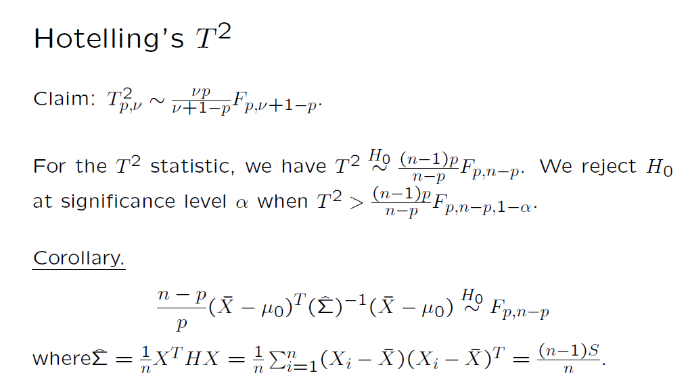

```{r setup, include=FALSE}
knitr::opts_chunk$set(echo = TRUE)
library(tidyr) #the pipe (%>%) tool is extremely useful
library(MASS)
```

# The Big Picture

### The Big Picture: Univariate vs Multivariate
- \textcolor{red}{Review}: A random sample, denoted by $X_1, \cdots, X_n$, from a (univariate) normal distribution $N(\mu, \sigma^2)$
  - What are the distributions of $\bar X,  s^2$? What useful statistics can be constructed?

- \textcolor{red}{New material}: A random sample, denoted by $\mathbf X_1, \cdots, \mathbf X_n$, from a multivariate normal distribution $N(\boldsymbol \mu, \boldsymbol \Sigma)$
  - What are the distributions of $\bar{\mathbf X},  \mathbf S$? What useful statistics can be constructed?
  
### The Big Picture: Univariate
- A random sample, denoted by $X_1, \cdots, X_n$, from a (univariate) normal distribution $N(\mu, \sigma^2)$
- Let $\mathbf X_{n\times 1}=(X_1, \cdots, X_n)^T$. It is random vector with a multivarite normal distribution, i.e., 
  $$\mathbf X_{n\times 1}=(X_1, \cdots, X_n)^T \sim \mathbf N(\mu\mathbf 1, \sigma^2\mathbf I)$$
1. $\bar X \sim N(\mu, \sigma^2/n)$
2. $\frac{(n-1)s^2}{\sigma^2} \sim \chi_{n-1}^2$
3. Independence between $\bar X$ and $s^2$.
4. a t-statistic is 
$$\frac{\frac{\bar X-\mu}{\sqrt{\sigma^2/n}}}{\sqrt{\frac{(n-1)s^2/\sigma^2}{n-1}}}=\frac{\sqrt{n}(\bar X-\mu)}{s}$$
It follows the t-distribution with n-1 degrees of freedom, denoted by $t_{n-1}$.

### The Big Picture: Multivariate  
- A random sample $\mathbf X_1, \cdots, \mathbf X_n$ from a multivariate normal distribution $\mathbf N(\boldsymbol \mu, \boldsymbol \Sigma)$.
- Let $$\mathbf X_{n\times p}=\begin{pmatrix}
\mathbf X_1^T \\ \vdots \\\mathbf X_n^T
\end{pmatrix}$$ 
$\mathbf X$ follows a matrix normal distribution.

1. Sample mean vector follows a multivariate normal, i.e., $\bar{\mathbf X} \sim \mathbf N(\boldsymbol \mu, \boldsymbol \Sigma/n)$

2. Sample covariance matrix $(n-1)\mathbf S$ follows a Wishart distribution, i.e., 
$(n-1)\mathbf S \sim Wishart_p (n-1, \Sigma)$

3. Independence between $\bar {\mathbf X}$ and $S$.
4. Hoetelling's $T^2$: $T^2 = (\bar{\mathbf X} - \boldsymbol \mu)^T\left(\frac{\mathbf S}{n}\right)^{-1} (\bar{\mathbf X} - \boldsymbol \mu)$


### The Big Picture: outline
- Sample variance and chi-squared distribution
- Sample covariance matrix and Wishart distribution
- Hotelling's $T^2$
- Maximum likelihood estimate


# Sample Variance
### Sample Variance and Chi-squared Distribution
- Let $\mathbf X=(X_1, \cdots, X_n)$ denote a random sample from $N(\mu, \sigma^2)$. 
- Equivalently, $\mathbf X \sim N(\mu \mathbf 1, \sigma^2 \mathbf I)$.
- Let $s^2=\frac{1}{n-1}\sum_{i=1}^n (X_i-\bar X)^2$ denote the sample variance. 
- We would like to show that 
$$\frac{(n-1)s^2}{\sigma^2}\sim \chi_{n-1}^2$$
- Outline of proof
  1. Projection matrices
  2. Chi-squared distribution
  3. Rewrite $(n-1)s^2/\sigma^2$ as the sum of squared $N(0,1)$ random variables
  

### Projection Matrices
- A projection matrix is a square matrix that is both idempotent and symmetric

$$\mathbf{P}^2 = \mathbf{P} \mbox{, }\mathbf{P}=\mathbf{P}^T $$

### Projection Matrices
- Suppose $\mathbf P$ is a projection matrix. We have
  - The eigenvalues of $\mathbf{P}$ has eigenvalues are either 0 or 1, and the number of 1's is the same as the rank of the projection matrix. 
  - $tr(\mathbf P) = rank(\mathbf P)$
  - The spectral decomposition of $\mathbf P$ is 
  $$\mathbf P=\sum_{i=j}^r \gamma_j\gamma_j^T$$
where $r=rank(\mathbf P)$, and $(\gamma_1, \cdots, \gamma_r)$ are orthogonal vectors of norm 1, i.e., 

$$
\gamma_i^T\gamma_j = \left\{
    \begin{array}{ll}
    1 & \mbox{if } i=j\\
    0 & \mbox{if } i\not=j    
    \end{array}
\right.
$$

### Example: Projection onto a Plane in \(\mathbb{R}^3\)

### Step 1: Define the Subspace (Plane \(x + y + z = 0\))
The plane equation \(x + y + z = 0\) has normal vector \(\mathbf{n} = [1,1,1]^T\).  
We need two basis vectors \(\mathbf{a}_1, \mathbf{a}_2\) that span the plane:

```{r basis}
a1 <- c(1, -1, 0)   # Satisfies x + y + z = 0
a2 <- c(0, 1, -1)    # Also satisfies x + y + z = 0
A <- cbind(a1, a2)   # Basis matrix
print(A)
```

### Step 2: Compute Projection Matrix \(P = A(A^TA)^{-1}A^T\)
```{r projection-matrix}
P <- A %*% solve(t(A) %*% A) %*% t(A)
print(P)
```

**Key Property**: Verify \(P^2 = P\) (idempotent):
```{r idempotent}
all.equal(P, P %*% P)  # Should return TRUE
```

### Step 3: Project a Vector onto the Plane
Let's project \(\mathbf{v} = [3,1,2]^T\):

```{r project-vector}
v <- c(1, 1, 2)
v_proj <- P %*% v
print(v_proj)  # Result should satisfy x + y + z = 0
```

**Verification**: Check if \(v_{\text{proj}}\) lies on the plane:
```{r verify}
sum(v_proj)  # Should be 0 (or very close due to floating-point)
```

### Explanation:
1. **Basis Vectors**: We chose \(\mathbf{a}_1 = [1,-1,0]^T\) and \(\mathbf{a}_2 = [0,1,-1]^T\) because they are linearly independent and satisfy the plane equation.
2. **Projection**: The matrix \(P\) sends any vector to its closest point on the plane.
3. **Visual Check**: The red point (projection) lies on the plane, and the blue point (original vector) connects to it via a dashed line (orthogonal to the plane).

**Interactive Tip**: Run this in RStudio and rotate the plot to see orthogonality!

### A Special Projection Matrix: the Centering Matrix
- The centering matrix $\mathbb C=\mathbf I - \frac{1}{n} \mathbf 1\mathbf 1^T$ is a very special matrix. 
- It is a projection matrix, which is defined as both symmetric and idempotent:
  - $\mathbb C^T=\mathbb C$ (symmetric) 
  - $\mathbb C^2= \mathbb C$ (idempotent)
- One important result about a projection matrix is that its eigenvalues are either zero or one. 
- By properties of projection matrices, we have 
  - $rank(\mathbb C) = tr(\mathbb C)=n-1$
  - $\mathbb C = \sum_{j=1}^{n-1}\gamma_j\gamma_j^T$


### A Special Projection Matrix: the Centering Matrix
- The centering matrix centers data
- Univariate: Let $\mathbf X_{n\times 1}$ be a random sample from $N(\mu, \sigma^2)$, i.e., 
$$\mathbf X_{n\times 1}\sim N(\mu\mathbf 1, \sigma^2 \mathbf I)$$

$\mathbb C\mathbf X$ is a linear function of $\mathbf X$ and it can be verified that $\mathbb C\mathbf 1=\mathbf 0$, we have
$$E[\mathbb C\mathbf X]=\mu \mathbb C\mathbf 1=\mathbf 0$$

- Multivariate: Let $\mathbf X_{n\times p}$ be a random sample from $N(\boldsymbol\mu, \boldsymbol \Sigma)$
Similarly, it can be shown that $\mathbb C \mathbf X$ has mean $\mathbf 0_{n\times p}$. We have verified this numerically. 

- In either situation, we have 
$\mathbb C \mathbf X = \mathbb C (\mathbf X-E[\mathbf X])$
This fact will be used later.

### Chi-squared distribution
- \textcolor{red}{Definition.} Let $Z_1, Z_2, ..., Z_k$ be independent standard normal random variables. Then, the sum of squares $Q = Z_1^2 + Z_2^2 + ... + Z_k^2$ has a chi-squared distribution with $k$ degrees of freedom, denoted by $\chi_k^2$.

- Alternative definition. Let $\mathbf Z_{k\times 1} \sim N(\mathbf 0, \mathbf I)$. We say $||\mathbf Z||^2=\mathbf Z^T \mathbf Z$ follows $\chi_k^2$. 

- The PDF of a chi-squared random variable with $k$ degrees of freedom is given by:

$$
f(x) = \frac{1}{2^{k/2}\Gamma(k/2)} x^{k/2-1} e^{-x/2} \mbox{,  } x>0
$$

where $\Gamma(\cdot)$ is the gamma function.


### Chi-squared distribution
- The chi-squared distribution is a special case of the gamma distribution, where the shape parameter is $k/2$ and the rate parameter is 1/2.

- The MGF of a chi-squared random variable with $k$ degrees of freedom is:
$$
M_X(t) = (1-2t)^{-k/2}
$$

- The mean and variance of a chi-squared random variable with $k$ degrees of freedom are:

$$\text{E}[X] = k \mbox{, }\text{Var}[X] = 2k$$


### Construct Chi-squared R.V.s using Normal R.V.s and Projection Matrices
- Let $\mathbf P_{n\times n}$ be a projection matrix with rank $r$ and let $\mathbf Z_{n\times 1}\sim N(\mathbf 0, \mathbf I)$
$$
\begin{aligned}
\mathbf Z^T \mathbf P \mathbf Z &= \mathbf Z^T \sum_{i=1}^r \gamma_i \gamma_i^T \mathbf Z= \sum_{i=1}^r \mathbf Z^T \gamma_i \gamma_i^T \mathbf Z\\
&= \sum_{i=1}^r (\gamma_i^T \mathbf Z)^T(\gamma_i^T \mathbf Z)
\end{aligned}
$$

Let $Y_i = \gamma_i^T \mathbf Z$. Note that $Y_i$ is univariate and it is a linear combination of $\mathbf Z$, from which we can show that $Y_i \sim N(0, 1)$. In addition, we can show that $Cov(Y_i, Y_j)=0$ for $i\not=j$. Thus, $Y_1, \cdots, Y_r\overset{iid}\sim N(0,1)$.

- Note that $\mathbf Z^T \mathbf P \mathbf Z=\sum_{i=1}^r Y_i^2$. By the definition of chi-squared distribution, we have 
$\mathbf Z^T \mathbf P \mathbf Z\sim \chi_r^2$

### The Sample Variance
- We have shown that 
  - $\mathbb C = \mathbf I  - \frac{1}{n} \mathbf 1 \mathbf 1^T$
  - $\mathbb C^T=\mathbb C$, $\mathbb C^2=\mathbb C$. 
  - It is a projection matrix with rank $n-1$ and 
$$\mathbb C = \sum_{j=1}^{n-1}\gamma_i\gamma_i^T$$
  -The he centering matrix does center data, i.e., 
$$\mathbb C \mathbf X = \mathbb C (\mathbf X - E[\mathbf X])$$
  - $(n-1)s^2=\mathbf X^T\mathbb C \mathbf X$, where


### The Sample Variance
- Therefore, 
$$
\begin{aligned}
\frac{(n-1)s^2}{\sigma^2}&=\frac{\mathbf X^T \mathbb C \mathbf X}{\sigma^2}=\frac{\mathbf X^T \mathbb C^T \mathbb C \mathbb C \mathbf X}{\sigma^2}\\
&=\frac{(\mathbb C\mathbf X)^T  \mathbb C \mathbb C\mathbf X}{\sigma^2}\\
&=\frac{(\mathbf X - E[\mathbf X])^T}{\sigma}\mathbb C  \frac{(\mathbf X - E[\mathbf X])}{\sigma}
\end{aligned}$$

### The Sample Variance
- Let 
$$\mathbf Z=\frac{(\mathbf X - E[\mathbf X])}{\sigma}$$
- Easy to see that $\mathbf Z\sim N(\mathbf 0, \mathbf I)$. Thus, 

$$\frac{(n-1)s^2}{\sigma^2}=\mathbf Z^T \mathbb C \mathbf Z$$

- Use the result in previous slides, we have 
$$\frac{(n-1)s^2}{\sigma^2}=\mathbf Z^T \mathbb C \mathbf Z \sim \chi_{n-1}^2$$


# Sample Covariance
### The Sample Covriance from A MVN Random Sample
- Let $\mathbf X_1, \cdots,\mathbf X_n \overset{iid} \sim N(\boldsymbol \mu, \boldsymbol \Sigma)$. 
- Recall that the sample covariance matrix is defined as 
 $$\mathbf S =\frac{1}{n-1} \sum_{i=1}^n (\mathbf X_i - \bar{\mathbf X})(\mathbf X_i - \bar{\mathbf X})^T$$
- We have shown that 
$$(n-1)\mathbf S = \mathbf X ^T \mathbb C \mathbf X$$
where $\mathbf X$ is the $n\times p$ random matrix. 


### The Sample Covriance from A MVN Random Sample
- The goal is to show that $(n-1)\mathbf S$ follows a Wishart distribution. More specifically, we would like to show that 
$$(n-1)\mathbf S \sim Wishart_p(n-1, \Sigma)$$
- Outline of proof
  1. Wishart-distribution
  2. Rewrite $(n-1)\mathbf S$
  3. Apply properties of a projection matrix
  4. Use the definition of Wishart distribution


### Wishart Distribution
- The Wishart distribution is named after the British statistician John Wishart, who introduced it in his 1928 paper published in Biometrika.

- Wishart was interested in the problem of estimating the covariance matrix of a multivariate normal distribution.

- Wishart showed that the sample covariance matrix follows a particular probability distribution that we now call the Wishart distribution.

- The Wishart distribution has become a fundamental tool in multivariate statistical analysis


### Definition of Wishart Distribution
- A Wishart distribution can be defined in the following way
- Let $\mathbf W$ be a $p\times p$ random matrix. We say $\mathbf W$ follows $Wishart_{p}(k, \boldsymbol \Sigma)$ if $\mathbf W$ can be written as $\mathbf W=\mathbf X^T \mathbf X$ where $\mathbf X$ denotes the random matrix formed by a random sample of size $k$ from MVN $N(\mathbf 0, \boldsymbol \Sigma)$. 

- The definition indicates that if we have a random sample $\mathbf X_1, \cdots \mathbf X_k$ from $N(\mathbf 0, \boldsymbol \Sigma)$, then $\mathbf X^T \mathbf X=\sum_{i=1}^k \mathbf X_i \mathbf X_i^T \sim Wishart_p(k, \boldsymbol \Sigma)$. 

- Remark:$E[\mathbf W]=k\Sigma$. 


### Wishart vs Chi-squared
- \textcolor{red}{Wishart}: If $\mathbf X_1, \cdots \mathbf X_k \overset{iid}\sim N(\mathbf 0, \boldsymbol \Sigma)$, then 
$$\mathbf X^T \mathbf X =\sum_{i=1}^k \mathbf X_i\mathbf X_i^T \sim Wishart_p(k, \boldsymbol \Sigma) \mbox{, where } \mathbf X_{k\times p}=\begin{pmatrix}
X_1^T\\ \vdots\\ X_k^T
\end{pmatrix}
$$

- \textcolor{red}{Chi-squared}: If $X_1, \cdots, X_k \overset{iid}\sim N(0,1)$, then  
$$\mathbf X^T\mathbf X=\sum_{i=1}^k X_i^2\sim \chi_k^2 \mbox{, where } \mathbf X_{k\times 1}= 
\begin{pmatrix}
X_1 \\ \vdots \\ X_k
\end{pmatrix}$$

### Wishart vs Chi-squared (continued)
- When $p=1$, 
$$W=\sum_{i=1}^k X_i^2 = \sigma^2 \sum_{i=1}^k \left(\frac{X_i}{\sigma} \right)^2\sim \sigma^2 \chi_k^2 $$
  

### The Sample Covariance Matrix
- Let $\mathbf X_1, \cdots \mathbf X_n$ be a random sample from $N(\boldsymbol \mu, \boldsymbol \Sigma)$. 
The $\mathbf X_{n\times p}$ follows a matrix normal distribution:
$$\mathbf X \sim N(\mathbf 1_n \otimes \boldsymbol \mu^T, \boldsymbol \Sigma, \mathbf I_n)$$

- The sample covariance $(n-1)\mathbf S=\mathbf X^T \mathbb C \mathbf X$ is based on the centered data. The definition of Wishart distribution is not applicable immediately. 
- Next we show that $(n-1)\mathbf S$ follows $Wishart_p(n-1, \boldsymbol\Sigma)$. 


### The Sample Covariance Matrix
- Rewrite $(n-1)\mathbf S$:
$$
\begin{aligned}
(n-1)\mathbf S&=\mathbf X^T \mathbb C^T\mathbb C\mathbb C \mathbf X=(\mathbb C \mathbf X)^T(\mathbb C \mathbf X)\\
&=(\mathbb C \mathbf X)^T\mathbb C(\mathbb C \mathbf X)\\
&=(\mathbb C \mathbf X)^T\sum_{j=1}^{n-1}\gamma_i \gamma_i^T (\mathbb C \mathbf X)\\
&=\sum_{j=1}^{n-1} (\gamma_i^T \mathbb C \mathbf X)^T (\gamma_i^T \mathbb C \mathbf X)
\end{aligned}$$


### The Sample Covariance Matrix
- Let $Y_i= (\gamma_i^T \mathbb C \mathbf X)^T$, we have
  - $E[Y_i]=0$ because $\mathbb C$ is the centering matrix
  - In the following, we show that $Y_i$ and $Y_j$ are uncorrelated for $i\not=j$:

$$\begin{aligned}
  Cov[Y_i, Y_j]&=E[(Y_i-\mathbf 0 )(Y_j-\mathbf 0)^T]\\
  &= E[Y_iY_j^T] \\
  &= E[(\gamma_i^T \mathbb C \mathbf X)^T(\gamma_j^T \mathbb C \mathbf X)]\\
  &= E[\mathbf X^T \mathbb C \gamma_i \gamma_j^T \mathbb C \mathbf X] \\
  &=\mathbf 0
  \end{aligned}$$

The last step is true because for $i\not=j$, $\gamma_i \gamma_j^T=0$


### The Sample Covariance Matrix
- Since $Y_i$ and $Y_j$ are two linear combinations of the same MVN distributed random matrix (or its vectorized version), we have $Y_i$ and $Y_j$ are independent for $i\not=j$. 

- It can also be shown that $Y_i \sim N(\mathbf 0, \Sigma)$. 

- By the definition of Wishart, we can conclude that 
$$(n-1)\mathbf S\sim Wishart_p(n-1, \boldsymbol \Sigma)$$

### Some Interesting Results
- Consider a random sample from MVN $N(\boldsymbol \mu, \boldsymbol \Sigma)$. Let $\mathbf S$ denote the sample covariance matrix. 

- We have already shown that $(n-1)\mathbf S \sim Wishart_p(n-1, \boldsymbol \Sigma)$

- What is the distribution of a diagonal element of $(n-1)\mathbf S$?

- What is the distribution of the sum of elements of $(n-1)\mathbf S$? Note, this is a special case of next question with $\mathbf B=(1, \cdots, 1)$.

- What is the distribution of $(n-1)\mathbf B \mathbf S \mathbf B^T$ where $B$ is a fixed $q\times p$ matrix? 

- If time permits, we will run some simulations


### Some Interesting Results (continued)
- If you cannot get the answer to the last question, let's use the definition of Wishart distribution. 

- Let $\mathbf W = (n-1)S$. Because it follows $Wishart_p(n-1, \boldsymbol\Sigma)$, we know that $\mathbf W=\sum_{j=1}^{n-1} \mathbf Z_j \mathbf Z_j^T$ where $\mathbf Z_j$'s are iid frm $N(\mathbf 0, \boldsymbol\Sigma)$. 

- Then
$$
\begin{aligned}
(n-1)\mathbf B \mathbf S \mathbf B^T &= \mathbf B\sum_{j=1}^{n-1} \mathbf Z_j \mathbf Z_j^T\mathbf B = \sum_{j=1}^{n-1} \mathbf B \mathbf Z_j \mathbf Z_j^T\mathbf B^T\\
&= \sum_{j=1}^{n-1} (\mathbf B \mathbf Z_j)(\mathbf B \mathbf Z_j)^T
\end{aligned}
$$


### Some Interesting Results (continued)

Let $\mathbf Y_j=\mathbf B \mathbf Z_j$. Note that it is a linear function of $\mathbf Z_j$; therefore 
$$\mathbf Y_j\sim N(\mathbf 0, \mathbf B \boldsymbol \Sigma \mathbf B^T)$$ and the $\mathbf Y_j$'s are iid (becaue ...). 

By the definition of Wishart distribution, we have 

$$(n-1)\mathbf B \mathbf S \mathbf B^T\sim Wishart_q(n-1, \mathbf B \boldsymbol \Sigma \mathbf B^T)$$


# Hotelling's $T^2$
### The Hotelling's $T^2$ Statistic
- Finally we are ready to introduce Hotelling's 

- The student's t is used for making inference of mean(s) of normal distribution(s)

- Hotelling generalized the student's t, which is for univarite, to Hotelling's T<sup>2</sup>, which the multivariate version


### Definition Hotelling's $T^2$
- \textcolor{red}{Definition. }We say a random variable follows Hotelling's $T_{p,\nu}^2$ if the random variable can be written as $\mathbf Z^T\left(\frac{W}{\nu}\right)^{-1}\mathbf Z$ where
  1. $\mathbf Z\sim N(\mathbf 0, \boldsymbol\Sigma)$
  2. $\mathbf W \sim W_p(\nu, \boldsymbol\Sigma)$
  3. $\mathbf Z \perp \mathbf W$


### One-Sample Hotelling $T^2$
- Let $\boldsymbol{X}_1, \boldsymbol{X}_2, ..., \boldsymbol{X}_n$ be a random sample from a multivariate normal distribution with mean vector $\boldsymbol{\mu}$ and covariance matrix $\boldsymbol{\Sigma}$.
- The sample mean vector and sample covariance matrix are denoted by $\bar{\mathbf X}$ and $\mathbf S$, respectively. 
- The null hypothesis of interest
$H_0: \boldsymbol \mu = \boldsymbol \mu_0$ 
- The one-sample Hotelling $T^2$ is defined as
$$T^2=(\hat{\mathbf \mu} - \mathbf \mu_0)^T \left(Cov(\hat{\mathbf \mu})\right)^{-1}(\hat{\mathbf \mu} - \mathbf \mu_0)$$


### One-Sample Hotelling $T^2$ (continued)
- To see that $T^2$ does follow Hotelling's $T^2$, we rewrite it
$$
\begin{aligned}
T^2&=(\hat{\mathbf \mu} - \mathbf \mu_0)^T \left(Cov(\hat{\mathbf \mu})\right)^{-1}(\hat{\mathbf \mu} - \mathbf \mu_0)\\
&= (\bar{\mathbf X} - \mathbf \mu_0)^T \left(Cov(\bar{\mathbf X})\right)^{-1}(\bar{\mathbf X} - \mathbf \mu_0)\\
&= (\bar{\mathbf X} - \mathbf \mu_0)^T \left(\frac{S}{n}\right)^{-1}(\bar{\mathbf X} - \mathbf \mu_0)\\
&= [\sqrt{n}(\bar{\mathbf X} - \mathbf \mu_0)]^T \left(\frac{(n-1)S}{n-1}\right)^{-1}[\sqrt{n}(\bar{\mathbf X} - \mathbf \mu_0)]
\end{aligned}
$$

- We have shown that all the three conditions for constructing a Hotelling's $T^2$ are satisfied
- As a result, $T^2\sim T_{p, n-1}^2$ when $H_0: \boldsymbol \mu=\boldsymbol \mu_0$. 

### Hotelling's $T^2$ Distribution vs $F$ Distribution
```{r echo=FALSE, out.width="80%"}

```


# MLE

### MLE:  Introduction

- The maximum likelihood estimate (MLE) is a widely used method for estimating the parameters of a statistical model.

- In this presentation, we will focus on the MLE for a multivariate normal distribution.

### MLE: Multivariate Normal Distribution

- A random vector $\boldsymbol{X}$ follows a $p$-dimensional multivariate normal distribution with mean vector $\boldsymbol{\mu}$ and covariance matrix $\boldsymbol{\Sigma}$, denoted by $\boldsymbol{X} \sim \mathcal{N}_p(\boldsymbol{\mu}, \boldsymbol{\Sigma})$, if its probability density function is given by:

$$
f_{\boldsymbol{X}}(\boldsymbol{x}) = \frac{1}{(2\pi)^{p/2} |\boldsymbol{\Sigma}|^{1/2}} \exp\left(-\frac{1}{2} (\boldsymbol{x} - \boldsymbol{\mu})^T \boldsymbol{\Sigma}^{-1} (\boldsymbol{x} - \boldsymbol{\mu})\right)
$$

where $|\boldsymbol{\Sigma}|$ denotes the determinant of $\boldsymbol{\Sigma}$.

### MLE:Maximum Likelihood Estimate

- Let $\boldsymbol{X}_1, \boldsymbol{X}_2, ..., \boldsymbol{X}_n$ be a random sample from a multivariate normal distribution with mean vector $\boldsymbol{\mu}$ and covariance matrix $\boldsymbol{\Sigma}$.

- The log-likelihood function for the sample is given by:

$$
\ell(\boldsymbol{\mu}, \boldsymbol{\Sigma}) = -\frac{n}{2} \log(2\pi) -\frac{n}{2} \log|\boldsymbol{\Sigma}| - \frac{1}{2} \sum_{i=1}^n (\boldsymbol{X}_i - \boldsymbol{\mu})^T \boldsymbol{\Sigma}^{-1} (\boldsymbol{X}_i - \boldsymbol{\mu})
$$

- The MLE of $\boldsymbol{\mu}$ is the sample mean $\bar{\boldsymbol{X}} = \frac{1}{n} \sum_{i=1}^n \boldsymbol{X}_i$.

### MLE:Maximum Likelihood Estimate (continued)
- To derive the MLE of $\boldsymbol{\Sigma}$, we first take the derivative of the log-likelihood function with respect to $\boldsymbol{\Sigma}$ and set it equal to zero:

$$
\frac{\partial \ell}{\partial \boldsymbol{\Sigma}} = -\frac{n}{2} \boldsymbol{\Sigma}^{-1} + \frac{1}{2} \sum_{i=1}^n (\boldsymbol{X}_i - \boldsymbol{\mu})(\boldsymbol{X}_i - \boldsymbol{\mu})^T \boldsymbol{\Sigma}^{-2} = 0
$$

- Solving for $\boldsymbol{\Sigma}$, we obtain the MLE as:

$$
\boldsymbol{\hat{\Sigma}} = \frac{1}{n} \sum_{i=1}^n (\boldsymbol{X}_i - \boldsymbol{\hat{\mu}})(\boldsymbol{X}_i - \boldsymbol{\hat{\mu}})^T
$$

- where $\boldsymbol{\hat{\mu}}$ is the MLE of $\boldsymbol{\mu}$, as previously derived.

