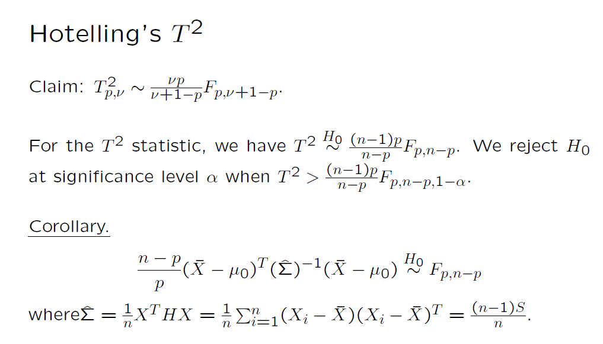
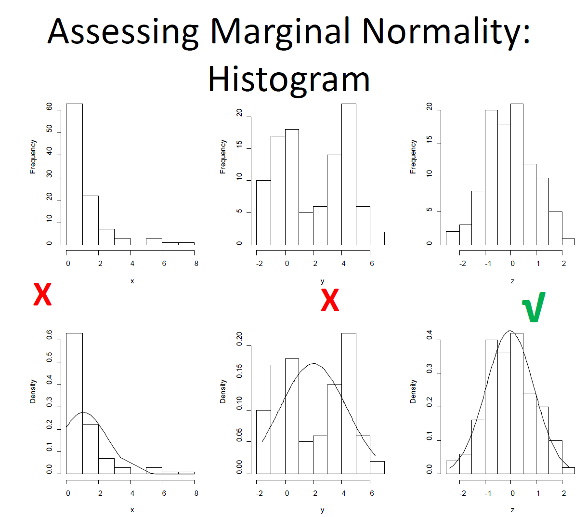
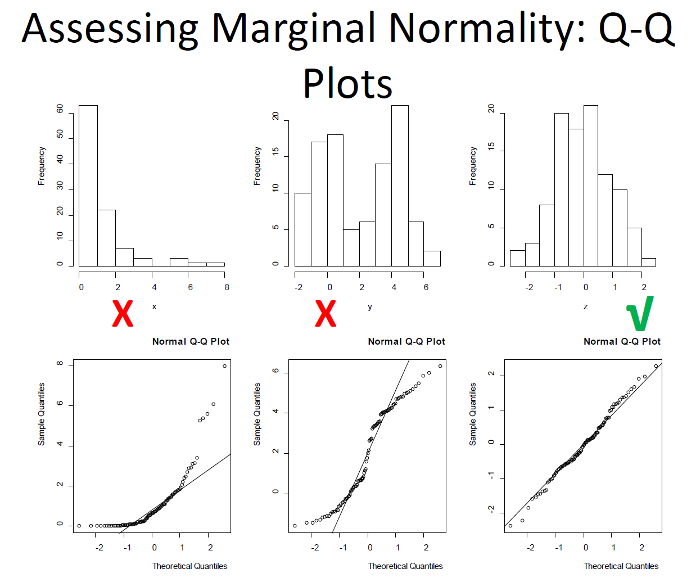
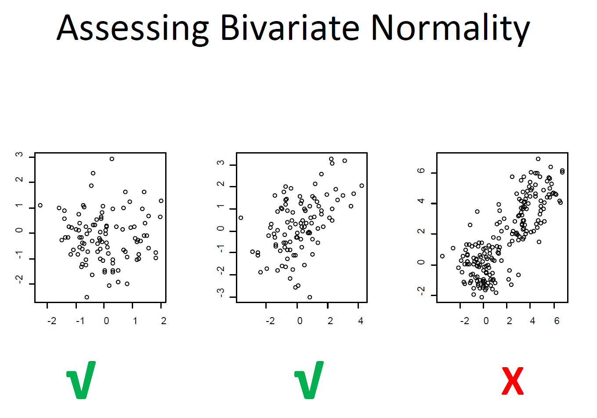

```{r setup, include=FALSE}
knitr::opts_chunk$set(echo = TRUE)
library(tidyr) #the pipe (%>%) tool is extremely useful
library(MASS)
#knitr::knit_exit()  # Stops rendering immediately  
def.chunk.hook  <- knitr::knit_hooks$get("chunk")
knitr::knit_hooks$set(chunk = function(x, options) {
  x <- def.chunk.hook(x, options)
  paste0("\n \\", "footnotesize","\n\n", x, "\n\n \\Huge")
})
```


### Outline of Lecture 07
- Review of Wishart and the Hotelling's $T^2$ distribution for one-sample problems
- Examples of one-sample Hotelling's $T^2$
- Two-sample Hotelling's $T^2$
- Examples of two-sample Hotelling's $T^2$
- The multivariate normality (MVN) assumption 


# Review

## Wishart Distribution
### Definition of Wishart Distribution
- A Wishart distribution can be defined in the following way
- Let $\mathbf W$ be a $p\times p$ random matrix. We say $\mathbf W$ follows $Wishart_{p}(k, \boldsymbol \Sigma)$ if $\mathbf W$ can be written as $\mathbf W=\mathbf X^T \mathbf X$ where $\mathbf X$ denotes the random matrix formed by a random sample of size $k$ from MVN $N(\mathbf 0, \boldsymbol \Sigma)$. 

- The definition indicates that if we have a random sample $\mathbf X_1, \cdots \mathbf X_k$ from $N(\mathbf 0, \boldsymbol \Sigma)$, then $\mathbf X^T \mathbf X=\sum_{i=1}^k \mathbf X_i \mathbf X_i^T \sim Wishart_p(k, \boldsymbol \Sigma)$. 

- Remark:$E[\mathbf W]=k\Sigma$. 

### Wishart vs Chi-squared
- \textcolor{red}{Wishart}: If $\mathbf X_1, \cdots \mathbf X_k \overset{iid}\sim N(\mathbf 0, \boldsymbol \Sigma)$, then 
$$\mathbf X^T \mathbf X =\sum_{i=1}^k \mathbf X_i\mathbf X_i^T \sim Wishart_p(k, \boldsymbol \Sigma) \mbox{, where } \mathbf X_{k\times p}=\begin{pmatrix}
X_1^T\\ \vdots\\ X_k^T
\end{pmatrix}
$$

- \textcolor{red}{Chi-squared}: If $X_1, \cdots, X_k \overset{iid}\sim N(0,1)$, then  
$$\mathbf X^T\mathbf X=\sum_{i=1}^k X_i^2\sim \chi_k^2 \mbox{, where } \mathbf X_{k\times 1}= 
\begin{pmatrix}
X_1 \\ \vdots \\ X_k
\end{pmatrix}$$

### Wishart vs Chi-squared (continued)
- When $p=1$, 
$$W=\sum_{i=1}^k X_i^2 = \sigma^2 \sum_{i=1}^k \left(\frac{X_i}{\sigma} \right)^2\sim \sigma^2 \chi_k^2 $$
  

### The Sample Covariance Matrix
- Let $\mathbf X_1, \cdots \mathbf X_n$ be a random sample from $N(\boldsymbol \mu, \boldsymbol \Sigma)$. 
The $\mathbf X_{n\times p}$ follows a matrix normal distribution:
$$\mathbf X \sim N(\mathbf 1_n \otimes \boldsymbol \mu^T, \boldsymbol \Sigma, \mathbf I_n)$$

- We have shown that 

$$(n-1)\mathbf S \sim Wishart_p(n-1, \boldsymbol\Sigma)$$ 


### A Simulation Study to Understand the Wishart Distribution
- Recall that if $W\sim Wishart_p(k, \boldsymbol \Sigma)$, then $E[\mathbf W]=k\Sigma$.

\tiny
```{r}
library(MASS)
p=2; n=5; B=1000; rho=0.7
Sigma=diag(1+rho, p, p) - matrix(rho, p, p)
wmat.array=array(0, c(B, p, p)) #wishart-distributed
for(b in 1:B){
  X=mvrnorm(n, rep(0,p), Sigma)
  wmat.array[b,,]=(n-1)*cov(X)}
apply(wmat.array, c(2,3), mean)
Sigma*(n-1)
```
\normalsize


## Hotelling's $T^2$
### Definition of Hotelling's $T^2$
- Hotelling generalized the student's t, which is for univarite, to Hotelling's $T^2$, which is the multivariate version
- \textcolor{red}{Definition. }We say a random variable follows Hotelling's $T_{p,\nu}^2$ if the random variable can be written as $\mathbf Z^T\left(\frac{W}{\nu}\right)^{-1}\mathbf Z$ where
  1. $\mathbf Z\sim N(\mathbf 0, \boldsymbol\Sigma)$
  2. $\mathbf W \sim W_p(\nu, \boldsymbol\Sigma)$
  3. $\mathbf Z \perp \mathbf W$


# One-Sample Hotelling $T^2$

### One-Sample Hotelling $T^2$
- Let $\boldsymbol{X}_1, \boldsymbol{X}_2, ..., \boldsymbol{X}_n$ be a random sample from a multivariate normal distribution with mean vector $\boldsymbol{\mu}$ and covariance matrix $\boldsymbol{\Sigma}$.
- The sample mean vector and sample covariance matrix are denoted by $\bar{\mathbf X}$ and $\mathbf S$, respectively. 
- The null hypothesis of interest
$H_0: \boldsymbol \mu = \boldsymbol \mu_0$ 
- The one-sample Hotelling $T^2$ is defined as
$$T^2=(\hat{\mathbf \mu} - \mathbf \mu_0)^T \left(Cov(\hat{\mathbf \mu})\right)^{-1}(\hat{\mathbf \mu} - \mathbf \mu_0)$$

- We have shown that $T^2\sim T_{p, n-1}^2$ when $H_0: \boldsymbol \mu=\boldsymbol \mu_0$. 

### Hotelling's $T^2$ Distribution vs $F$ Distribution
```{r echo=FALSE, out.width="80%"}

```


### Write an R function to conduct Hotelling's $T^2$
- There is no R base function for conducting Hotelling's $T^2$ test
- We will write an R function

\tiny
```{r}
#Hotelling's T^2 for testing H0: mu=mu0 vs mu != mu0
Hotelling.T2.1sample=function(X, mu0)
{
  n=dim(X)[1]
  p=dim(X)[2]
  X.bar=colMeans(X)
  X.S=cov(X)
  T2=n*t(X.bar-mu0)%*%solve(X.S)%*%(X.bar-mu0)
  p.value=1-pf(T2/((n-1)*p/(n-p)),p,n-p)
  return(list(X.bar=X.bar, X.cov=X.S, T2=T2, p.value=p.value))
}
```
\normalsize


### Example of Multivariate One-Sample Problem: Protein Intake
- For the protein intake data, it might be more interesting to estimate the means than conducting hypothesis testing
- Suppose we are interested in estimating the means of the daily protein intake from different sources

\tiny
```{r}
library(MASS)#the library "MASS" is required
my.cov=4*(diag(4) + 0.3* rep(1,4)%o%rep(1,4))
n=60;p=4
my.mean=8*c(3,2,1,1)
eigen(my.cov)#to check whether the cov matrix is p.d.
```
\normalsize


### Example of Multivariate One-Sample Problem: Protein Intake
- Estimate the mean vector using the sample mean vector
- Estimate covariance of the sample mean vector. Recall that $cov(\bar{\mathbf X})=\frac{\boldsymbol \Sigma}{n}$

\tiny
```{r}
set.seed(1)
x=mvrnorm(n, mu=my.mean, Sigma=my.cov)
protein=as.matrix(data.frame(meat=x[,1],dairy=x[,2], 
                             veg=x[,3], other=x[,4]))
colMeans(protein)
cov(protein)/n
```


### Example of Multivariate One-Sample Problem: Protein Intake
- Use Hotelling's $T^2$ to quantify uncertainties. Recall that 
$$T^2=(\bar{\mathbf X} - \boldsymbol \mu)^T \left(Cov(\bar{\mathbf X})\right)^{-1}(\bar{\mathbf X} - \boldsymbol \mu)\sim \frac{(n-1)p}{n-p} F_{p, n-p}$$

where $Cov(\bar{\mathbf X})=\frac{\mathbf S}{n}$.

\normalsize

- The result indicates that 
$$Pr[(\bar{\mathbf X} - \boldsymbol \mu)^T \left(Cov(\bar{\mathbf X})\right)^{-1}(\bar{\mathbf X} - \boldsymbol \mu)\le \frac{(n-1)p}{n-p} F_{p, n-p, 1-\alpha}]=1-\alpha$$


- Thus, a $(1-\alpha)100\%$ confidence \textcolor{red}{region} for $\boldsymbol \mu$ is 
$$\{\mathbf\mu: (\mathbf{\bar X} - \boldsymbol \mu)^T \left(Cov(\mathbf{\bar X})\right)^{-1}(\mathbf{\bar X} - \boldsymbol \mu)\le \frac{(n-1)p}{n-p} F_{p, n-p, 1-\alpha}\}$$


### Example of Multivariate One-Sample Problem: Protein Intake
- The confidence region has exactly $(1-\alpha)100\%$ confidence; however
- In many situations, we would like to construct confidence intervals, which are in the form of 
$$\mbox{estimate}\pm \mbox{critical value} \times \mbox{standard error}$$  
- If there is only one parameter of interest, we can construct a C.I. using t-distribution, just as in univariate analysis
- Example. What is the mean protein intake from source $j$? 
  - Lecture 04: we constructed a large-sample C.I. by using 1.96 as the critical value. (See the protein intake example)

  - This lecture: we construct a C.I. for $\mu_j$ by using $t_{n-1, 1-\frac{\alpha}{2}}$ as the critical value

  $$\bar{X}_{(j)} \pm t_{n-1, 1- \frac{\alpha}{2}}\sqrt{\frac{s^2_{X_{(j)}}}{n}} $$


# Simultaneous C.I. 
### The Coverage of simultaneous C.I.s
- Let $A_j=\{\mu_j\mbox{ is in the constructed C.I. }\}$. The C.I. in the previous slide has $(1-\alpha)100\%$ coverage for a specific $\mu_j$, i.e., 
$$Pr(A_j)=1-\alpha$$
- If we are interested in all the parameters, which are $\mu_1, \mu_2, \mu_3, \mu_4$ in the protein intake example. The coverage for the mean vector is 
$$Pr(A_1\cap A_2 \cap A_3 \cap A_4)$$
- Clearly $Pr(A_1\cap A_2 \cap A_3 \cap A_4)<1-\alpha$
- Thus, if we use $t_{n-1, 1-\frac{\alpha}{2}}$ as the critical value, we do not have enough coverage for all the parameters in $\boldsymbol \mu$ simultaneously

- What we need to construct are \textcolor{red}{simultaneous confidence intervals}


### Methods for Simultaneous Confidence Intervals
- Method 1 for simultaneous C.I. $T^2$.
Some linear algebra result ensures that the following method gives $(1-\alpha)100\%$ confidence to cover all linear combinations of the parameters (in the form of $a^T\boldsymbol \mu$) simultaneously
$$a^T\bar{\mathbf X}\pm \sqrt{\frac{(n-1)p}{n-p}F_{p, n-p, 1-\alpha}} se(a^T\bar{\mathbf X}) $$


- Method 2 Bonferroni's correction: simply replace $\alpha$ with $\alpha/k$ where $k$ is the total number of linear functions of the mean parameters: $t_{n-1, 1-\alpha/(2k)}$, where $k$ is the number of parameters of interest. 


### Simultaneous C.I.s using $T^2$: Protein Intake

\tiny
```{r}
#sample means
colMeans(protein)
#standard errors
sqrt(diag(cov(protein)/n))
#critical value based on T2
cv=sqrt((n-1)*p/(n-p)*qf(0.95, p, n-p))
#lower bounds
low.bound=colMeans(protein) - cv *sqrt(diag(cov(protein)/n))
#upper bounds
up.bound=colMeans(protein) + cv *sqrt(diag(cov(protein)/n))
```
\normalsize


### Simultaneous C.I.s using $T^2$: Protein Intake

```{r}
#put everything into a table
data.frame(lower=low.bound, mean=colMeans(protein), 
           upper=up.bound)
```

### Simultaneous C.I.s using Bonferroni: Protein Intake

\tiny
```{r}
#sample means
colMeans(protein)
#standard errors
sqrt(diag(cov(protein)/n))
#critical value based on T2
cv=qt(1-0.05/p/2, n-1)
#lower bounds
low.bound=colMeans(protein) - cv *sqrt(diag(cov(protein)/n))
#upper bounds
up.bound=colMeans(protein) + cv *sqrt(diag(cov(protein)/n))
```
\normalsize


### Simultaneous C.I.s using Bonferroni: Protein Intake
```{r}
#put everything into a table
data.frame(lower=low.bound, mean=colMeans(protein), 
           upper=up.bound)
```

### Comparison of Different Critical Values
- Three choices of critical values
  - unadjusted: $t_{n-1, 1-\alpha/2}$. Should \textcolor{red}{NOT} be used if multiple linear functions need to be estimated
  - $T^2$: $\sqrt{\frac{(n-1)p}{n-p}F_{p, n-p, 1-\alpha}}$
  - Bonferroni's correction: simply replace $\alpha$ with $\alpha/k$ where $k$ is the total number of linear functions of the mean parameters: $t_{n-1, 1-\alpha/(2k)}$

- Example: the critical values for the individual means from four protein sources


### Comparison of Different Critical Values Protein Intake

\tiny
```{r}
#unadjusted, shouldn't be used when constructing simultaneous C.I.s
qt(1-0.05/2, n-1)
#T^2
sqrt((n-1)*p/(n-p)*qf(0.95, p, n-p))
#Bonferroni correction
qt(1-0.05/p/2, n-1)
```
\normalsize


# Two-Sample Hotellings $T^2$
### One-Sample vs Two-Sample
- In the one-sample problem, the goal is to make inference of
  - univariate: a population mean (one-sample t-test problem) or
  - multivariate: a population mean vector (one-sample Hotelling $T^2$ problem)
- In the two-sample problem
  - univariate: compare two population means
  - multivariate: compare two population mean vectors


### Univariate Two-Sample Problems
- Two independent samples
  - Sample 1 is from population 1:
  
  $$X_{11}, \cdots, X_{1,n_1}\overset{iid} \sim N(\mu_1,\sigma^2)$$
  - Sample 2 is from population 2: 
  
  $$X_{21}, \cdots, X_{2,n_2}\overset{iid} \sim N(\mu_2,\sigma^2)$$
- Null hypothesis: $H_0: \mu_1=\mu_2$


### Univariate Two-Sample Problems
- Pooled sample variance
  
$$s^2_p = \dfrac{(n_1-1)s^2_1+(n_2-1)s^2_2}{n_1+n_2-2}$$ 
where
$$s^2_i = \dfrac{\sum_{j=1}^{n_i}X^2_{ij}-(\sum_{j=1}^{n_i}X_{ij})^2/n_i}{n_i-1}$$  

- Two-sample t-statistic
$$t = \dfrac{\bar{x}_1-\bar{x}_2}{\sqrt{s^2_p(\dfrac{1}{n_1}+\dfrac{1}{n_2})}} $$

- Null distribution: $t\overset{H_0}\sim t_{n_1+n_2-2}$.


### Multivarite Two-Sample Problems
- Two independent samples
  - Sample 1 is from population 1:
  
  $$\mathbf X_{11}, \cdots,\mathbf  X_{1,n_1}\overset{iid} \sim N(\boldsymbol \mu_1, \boldsymbol \Sigma)$$

  - Sample 2 is from population 2:
  
  $$\mathbf X_{21}, \cdots,\mathbf  X_{2,n_2}\overset{iid} \sim N(\boldsymbol \mu_2, \boldsymbol \Sigma)$$

- Null and alternative hypotheses: $H_0: \boldsymbol \mu_1=\boldsymbol \mu_2$ vs $H_1: \boldsymbol \mu_1\not=\boldsymbol \mu_2$


### Multivarite Two-Sample Problems
- Pooled sample covariance matrix
$$\mathbf{S}_p = \dfrac{(n_1-1)\mathbf{S}_1+(n_2-1)\mathbf{S}_2}{n_1+n_2-2}$$
where
$$\mathbf{S}_i = \dfrac{1}{n_i-1}\sum_{j=1}^{n_i}{(\mathbf X_{ij}-\bar{\mathbf X}_i)(\mathbf X_{ij}-\bar{\mathbf X}_i)'}$$

- Two-sample Hotelling's $T^2$
$$T^2 = {(\bar{\mathbf X}_1 - \bar{\mathbf X}_2)}^T\{\mathbf{S}_p(\frac{1}{n_1}+\frac{1}{n_2})\}^{-1} {(\bar{\mathbf X}_1 - \bar{\mathbf X}_2)}$$
- Null distribution:
$$T^2 \overset{H_0}\sim \frac{(n_1+n_2-2)p}{n_1+n_2-p-1} F_{p, n_1+n_2-p-1}$$

### Multivariate Two-Sample Problems: Write an R Function
- No existing base function in R. 

\tiny
```{r}
Hotelling.T2.2sample=function(X, Y){
  n=dim(X)[1]; m=dim(Y)[1]; p=dim(X)[2]
  if(p!= dim(Y)[2]) return("Error: the dimensions of X and Y are not the same")
  X.bar=colMeans(X); Y.bar=colMeans(Y)
  X.S=cov(X); Y.S=cov(Y)
  pooled.S=((n-1)*X.S+(m-1)*Y.S)/(m+n-2)
  T2=t(X.bar-Y.bar)%*%solve((1/n+1/m)*pooled.S)%*%(X.bar-Y.bar)
  p.value=1-pf(T2/((n+m-2)*p/(n+m-1-p)),p,n+m-1-p)
  return(list(X.bar=X.bar, Y.bar=Y.bar, T2=T2, p.value=p.value))}
```
\normalsize


### Multivariate Two-Sample Problems: Write an R Function
- The built-in function "t.test" serves a dual-purpose function for univariate analyis
- We will write a dual-purpose function Hotelling.T2

```{r}
Hotelling.T2=function(X, Y=NULL, mu0=NULL)
{
 if(is.null(Y) && is.null(mu0) ) 
   return("Error: mu0 is not specified")
 if(!is.null(X) && !is.null(mu0)) 
   obj=Hotelling.T2.1sample(X, mu0) 
 if(!is.null(X) && !is.null(Y)) 
   obj=Hotelling.T2.2sample(X,Y)
 return(obj)
} 
```


### Multivariate Two-Sample Problems: Iris setosa vs versicolor

\tiny
```{r}
Hotelling.T2.2sample(iris[1:50,1:4], iris[51:100,1:4])
```
\normalsize

### Multivariate Two-Sample Problems: Example

\tiny
```{r}
Hotelling.T2(iris[1:50,1:4], iris[51:100,1:4])
```
\normalsize


### Linear Functions of Differences: Iris Setosa vs Versicolor
- We might be interested in the difference between iris setosa and versicolor in the four features

- Because we are interested all the four features, we do need to construct simultaneous C.I.s for the four features. Two methods to find critical values with adjustment for multiple C.I.s:
  - Method 1 - $T^2$: 
  
  $$\sqrt{\frac{(n_1+n_2-2)p}{n_1+n_2-p-1}F_{p, n_1+n_2-p-1, 1-\alpha}}$$

  - Method 2- Bonferroni's correction by replacing $\alpha$ with $\alpha/k$, i.e., use the following critical value
$$t_{n_1+n_2-2, 1-\alpha/(2k)}$$


### Linear Functions of Differences: Iris Setosa vs Versicolor
```{r}
n1=n2=50; p=4
mean1=matrix(colMeans(iris[1:50,1:p]), p, 1)
mean2=matrix(colMeans(iris[51:100,1:p]), p, 1)
mean.diff = mean1-mean2
S1=cov(iris[1:50,1:p]); S2=cov(iris[51:100,1:p]); 
Sp=( (n1-1)*S1+(n2-1)*S2 )/ (n1+n2-2)
```

### Linear Functions of Differences: Iris Setosa vs Versicolor
- Method 1: $T^2$

\tiny
```{r}
cv=sqrt((n1+n2-2)*p/(n1+n2-p-1)*qf(1-0.05, p, n1+n2-p-1 ))
round(data.frame(diff=mean.diff, se=sqrt(diag((1/n1+1/n2)*Sp) ),
CI.lower=mean1-mean2-qt(1-0.05/(2*p), n1+n2-2)*sqrt(diag((1/n1+1/n2)*Sp) ),
CI.upper=mean1-mean2+qt(1-0.05/(2*p), n1+n2-2)*sqrt(diag((1/n1+1/n2)*Sp) ) ), 3)
```
\normalsize


### Linear Functions of Differences: Iris Setosa vs Versicolor
- Method 2: Bonferroni

\tiny
```{r}
cv=qt(1-0.05/p/2, n1+n2-2)
round(data.frame(diff=mean.diff, se=sqrt(diag((1/n1+1/n2)*Sp) ),
CI.lower=mean1-mean2-qt(1-0.05/(2*p), n1+n2-2)*sqrt(diag((1/n1+1/n2)*Sp) ),
CI.upper=mean1-mean2+qt(1-0.05/(2*p), n1+n2-2)*sqrt(diag((1/n1+1/n2)*Sp) ) ), 3)
```
\normalsize


# Assess MVN

### The assumption of MVN
- We assume each observation $\mathbf X_i$ follows a MVN
- Assessing the assumption of multivariate normality is more difficult than assessing the assumption of normality (univariate)
- This is because univariate normality does not guarantee multivariate normality. Typically, we look at the following two items:
- It is difficult to examine joint normality in more than 2d. In practice, we do 1d and 2d
  - Marginal normality
  - Are pairs of variables show elliptical contours? 
- Are there outliers in the data?

### Assess Marignal Normality
- Useful visual tools: 
  - histogram
  - QQ plot
  - scatter plot
- Less useful tools (formal tests)
  - Kolmogorov-Smironov test
  - Shapiro-Wilk test (correlation coefficient between data and normal scores)

### Histograms

```{r echo=FALSE, out.width="60%", fig.align="center"}

```

### QQ plots

```{r echo=FALSE, out.width="60%", fig.align="center"}

```

### Bivariate Scatter Plots

```{r echo=FALSE, out.width="60%", fig.align="center"}

```


### Large-Sample Results
- Multivariate CLT

$$\begin{aligned}
& & \sqrt{n} (\bar{\mathbf X} -\boldsymbol \mu ) \overset{\mathbf D} \rightarrow N(\mathbf 0, \boldsymbol \Sigma)\\
& \Rightarrow & n(\bar{\mathbf X}-\boldsymbol \mu)^T \mathbf S^{-1}(\bar{\mathbf X}-\boldsymbol \mu) \rightarrow \chi_p^2
\end{aligned}
$$

- When $n-p$ is large, we replace $\frac{(n-1)p}{n-p}F_{p, n-p}$ with $\chi_{p}^2$
- When $n_1-p$ and $n_2-p$ are large, we replace $\frac{(n_1+n_2-2)p}{n_1+n_2-p-1}F_{p, n_1+n_2-p-1}$ with $\chi_{p}^2$

### Assignment 2: Due on Monday, April 28
\tiny
- \textcolor{red}{Problem 1}: Choose a $3-by-3$ covariance matrix with non-zero covariances. Also choose a sample size $n$ (e.g., n=100, 500, 1000, etc). Simulate 1,000 data sets from a trivariate normal distribution. 
  0. Hints: 
    - Hint 1: the R library MASS provides a function to generate a random sample from a multivariate normal distribution. 
    - Hint 2: Make sure that the covariance matrix you choose is positive definite.  You can compute the eigenvalues by the "eigen" function in R and and check whether all the eigenvalues are positive. 
  1. Try to make sense of the covariance matrix by examining the pairwise scatter plots using the data you simulate. 
  2. During the simulation, you will generate 1,000 Wishart distributed random matrices. Calculate the trace for each of them. Explain what distribution the traces should follow and examine their histogram.
  
- \textcolor{red}{Problem 2}: Find a good data example to conduct a two-sample Hotelling's $T^2$ test. Do not use the data example discussed in this course. Please (1) include visualizations as exploratory methods and (2) make conclusion in the context of the data example.  

- R Code should be included as appendices. 

\normalsize
