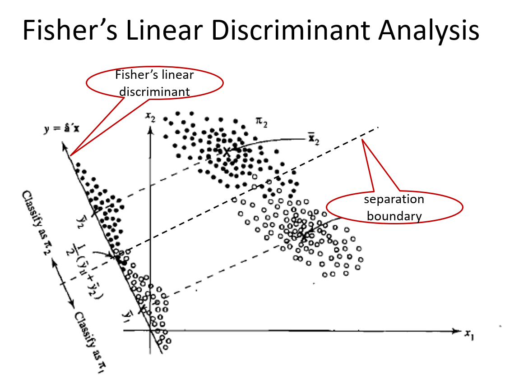

```{r setup, include=FALSE}
knitr::opts_chunk$set(echo = TRUE)
library(tidyr) #the pipe (%>%) tool is extremely useful
library(MASS)
library(ggplot2)
library(kableExtra)
library("gridExtra")
library(klaR) #visualize lda and qda
library(knitr)
```


# Outline
- Review of LDA
- QDA
- Decision theory
  - Equal costs
  - Unequal costs

# Review of LDA 

### Linear Discrminant Analysis
```{r, out.width="70%"}

```

## Two-Class Problems
### FLDA: Maximum Separability
- The maximization problem is
$$\operatorname*{argmax}_a \frac{a^T(\bar {\mathbf X}_1 - \bar {\mathbf X}_2)(\bar {\mathbf X}_1 - \bar {\mathbf X}_2)^Ta}{a^T \boldsymbol \Sigma a}$$
- Use an argument similar to PCA, such $a$ is the first eigenvector of $\boldsymbol \Sigma ^{-1}(\bar {\mathbf X}_1 - \bar {\mathbf X}_2)(\bar {\mathbf X}_1 - \bar {\mathbf X}_2)^T$.

- We can show that $a=\mathbf  S_p^{-1}(\bar {\mathbf X}_1 - \bar {\mathbf X}_2)$. 

- The linear function 
$$f(x)=a^T x \mbox{ where } a=\mathbf  S_p^{-1}(\bar {\mathbf X}_1 - \bar {\mathbf X}_2)$$
is called \textcolor{red}{Fisher's linear discriminant function}. 


### Allocate New Observations
- Consider an observation $X_0$. We compute
$$f(X_0)=a^T X_0$$ where $a=\mathbf  S_p^{-1}(\bar {\mathbf X}_1 - \bar {\mathbf X}_2)$
- Let 
$$m=a^T \frac{\bar {\mathbf X}_1 + \bar {\mathbf X}_2}{2}=\boldsymbol (\bar {\mathbf X}_1 - \bar {\mathbf X}_2)^T \mathbf  S_p^{-1}\frac{\bar {\mathbf X}_1 + \bar {\mathbf X}_2}{2}$$

- Allocate $X_0$ to 
  - class 1 if $f(X_0)>m$
  - class 2 if $f(x_0)<m$


## g-Class Problems
### Quantify Separation in a $g$-Class Problem
- Measure separation using F statistic

$$\begin{aligned}
F(a) &= \frac{MSB}{MSW}=\frac{SSB/(g-1)}{SSW/(n-g)}\\
&= \frac{\sum_{i=1}^g n_i (\bar Y_{i.}^{(1)} -\bar Y_{..}^{(1)})^2/(g-1)}{\sum_{i=1}^g (n_i-1)S_{Y_i^{(1)}}^2/(n-g)}\\
&=\frac{a^T \sum n_i (\bar X_{i.} -\bar X_{..})(\bar X_{i.}-\bar X_{..})^T a}{a^T \sum_{i=1}^g\sum_{j=1}^{n_i} (X_{ij} -\bar X_{i.})(X_{ij}-\bar X_{i.})^T a}\frac{n-g}{g-1}\\
&= \frac{a^T \mathbf B a}{a^T \mathbf W a}\frac{n-g}{g-1}
\end{aligned}$$
where $n=\sum_{i=1}^g n_i$, $\mathbf B$ is the between-group sample covariance matrix, and $\mathbf W$ is the within-group sample covariance matrix. 

### Linear Discriminants
- The first linear discriminant is the linear function that maximizes $F(a)$. It can also be shown that the first linear discriminant is given by the first eigenvector of $\mathbf W ^{-1} \mathbf B$, i.e., 
$$Y_{ij}^{(1)}=\gamma_1^T X_{ij}$$
where $\gamma_1$ is the first eigenvector of $\mathbf W ^{-1} \mathbf B$. 

- Similarly, for $k=1, \cdots, rank(\mathbf B)$, the $k$th linear discriminant is given by the $k$th eigenvector of $\mathbf W ^{-1} \mathbf B$

$$Y_{ij}^{(k)}=\gamma_k^T X_{ij}$$


### Use the Linear Discriminants
- Let $X_0$ be a new observation. We allocate it to the group with the minimum distance defined by the Euclidean distance in space spanned by the linear discriminants. 

- Calculate $Y_0^{(k)}=\gamma_k^T X_0$, the projection of $X_0$ to the $k$th linear discriminant for $k=1, \cdots, rank(B)$.
- Calculate the distance between $(Y_0^{(1)}, \cdots, Y_0^{(rank(B))})$ and $(\bar Y_{i.}^{(1)}, \cdots, \bar Y_{i.}^{(rank(B))})$
 
$$D^2(X_0, i) = \sum_{k=1}^{rank(B)} [Y_0^{(k)} - \bar Y_{i.}^{(k)}]^2$$

- Allocate $X_0$ to 
$$\operatorname*{argmin}_i D^2(X_0, i)$$


# QDA
## QDA for Two-Class Problems
- The LDA can be derived using likelihood functions under the assumptions
  1. Multivariate normal
  2. Equal covariance matrix
  
- The assumption of equal covariance matrix is not always a good approximation to the true covariance matrices
- If we relax this assumption, we will have QDA

### QDA for Two-Class Problems
- Let's consider a two-class classification problem with $n_1$ and $n_2$ observations in classes 1 and 2, respectively.
- Suppose we have two independent random samples
  - Sample 1: $X_{1j}\overset{iid}\sim N(\mathbf \mu_1, \boldsymbol \Sigma_1)$, where $j=1, \cdots, n_1$
  - Sample 2: $X_{2j}\overset{iid}\sim N(\mathbf \mu_2, \boldsymbol \Sigma_2)$, where $j=1, \cdots, n_2$
- Sample mean vectors: 
$$\bar {\mathbf X}_1=\frac{1}{n_1}\sum_{j=1}^{n_1}X_{1j}, 
\bar {\mathbf X}_2=\frac{1}{n_2}\sum_{j=1}^{n_2}X_{2j}$$

- Remark: the sample mean vectors are the MLE of the corresponding mean vectors

### QDA for Two-Class Problems
- MLE of covariance matrices
$$\hat {\boldsymbol\Sigma}_1  = \frac{n_1-1}{n_1}S_1, \hat {\boldsymbol\Sigma}_2  = \frac{n_2-1}{n_2}S_2$$
where $S_i$ is the sample covariance matrix for sample $i$. 

- Likelihood functions
$$\begin{aligned}
L_1(\boldsymbol \mu_1, \boldsymbol \Sigma_1) \propto |\boldsymbol\Sigma_1|^{-1/2} exp\{-\frac{1}{2} (x-\boldsymbol \mu_1)^T \boldsymbol \Sigma_1^{-1} (x-\boldsymbol \mu_1)\}\\
L_2(\boldsymbol \mu_2, \boldsymbol \Sigma_2) \propto |\boldsymbol\Sigma_2|^{-1/2} exp\{-\frac{1}{2} (x-\boldsymbol \mu_2)^T \boldsymbol \Sigma_2^{-1} (x-\boldsymbol \mu_2)\}
\end{aligned}$$

### QDA for Two-Class Problems
- We can either check whether the ratio is greater than one or check whether the difference of log-likelihood is positive.  

$$l_1 - l_2=-\frac{1}{2}log(\frac{|\boldsymbol\Sigma_1|}{|\boldsymbol\Sigma_2|}) - \frac{1}{2} [(x-\boldsymbol \mu_1)^T \boldsymbol \Sigma_1^{-1} (x-\boldsymbol \mu_1) - (x-\boldsymbol \mu_2)^T \boldsymbol \Sigma_2^{-1} (x-\boldsymbol \mu_2)]$$

- The classification boundary is given by $l_1-l_2=0$, i.e., 

$$(x-\boldsymbol \mu_1)^T \boldsymbol \Sigma_1^{-1} (x-\boldsymbol \mu_1) - (x-\boldsymbol \mu_2)^T \boldsymbol \Sigma_2^{-1} (x-\boldsymbol \mu_2) = log(\frac{|\boldsymbol\Sigma_2|}{|\boldsymbol\Sigma_1|})$$

- It is quadratic!

### QDA for Two-Class Problems
- Replace unknown parameters with estimate, we have the classification rule: allocate $x$ to class 1 if 
$$(x-\bar {\mathbf X}_1)^T \mathbf S _1^{-1} (x-\bar {\mathbf X}_1) - (x-\bar {\mathbf X}_2)^T \mathbf S_2^{-1} (x-\bar {\mathbf X}_2) < log(\frac{|\mathbf S_2|}{|\mathbf S_1|})$$

### QDA for g-Class Problems

- For the $i$th group, we compute a quadratic score, which is defined as  
$$Q_i(x)=(x-\bar {\mathbf X}_i)^T \mathbf S _i^{-1} (x-\bar {\mathbf X}_i)+ log(|\mathbf S_i|)$$

- Allocate $x$ to the class with the minimum quadratic score 


## Example of QDA
```{r, eval=FALSE}
obj.lda=lda(Species~., data = iris)
obj.qda=qda(Species~., data = iris)

table(Pred=predict(obj.lda, iris)$class,
True=iris$Species)
table(Pred=predict(obj.qda, iris)$class,
True=iris$Species)
```

### Example of QDA
```{r, echo=FALSE}
obj.lda=lda(Species~., data = iris)
obj.qda=qda(Species~., data = iris)

table(Pred=predict(obj.lda, iris)$class,
True=iris$Species)
table(Pred=predict(obj.qda, iris)$class,
True=iris$Species)
```
- The same result for this particular example

### Visualize QDA Results
```{r, out.width="80%"}
partimat(Species ~ ., data = iris, method = "qda")
```

### Visualize LDA Results
```{r, out.width="80%"}
partimat(Species ~ ., data = iris, method = "lda")
```


# Decision Theory
### Cost and Prior Probabilities
- In practice, different types of errors have different costs
- Prior probabilities are often known but we haven't discussed how to use them
- Goals: 
  - When different errors have the same cost, we look for a classification rule that minimizes the probability of misclassification   
  - When different errors cost differently, we want to find a classification rule that minimizes the total cost

# Equal Costs

## Minimize Probability of Misclassification
- Notations: 
- $X$: data
- $Z$: true class. It is binary, i.e., $Z=1$ or $Z=0$
- $P(Z=1)=\pi$: prior probability, known 
- $\delta(x)$: decision function / classifier
  - $\delta(x)=1$: allocate $x$ to group 1
  - $\delta(x)=0$: allocate $x$ to group 0

### Risk and Posterior Risk
- Risk of a classifier $\delta$
$$\begin{aligned}
R(\delta, z)&=\Pr [\delta(X)\not= Z|Z=z]=\mathbb E_{X|z} [\mathbb I_{\delta(X)\not= Z}|Z=z]\\
&=\left\{
\begin{array}{cc}
\Pr[\delta(X)=0|z=1] & \mbox{ if } z=1\\
\Pr[\delta(X)=1|z=0] & \mbox{ if } z=0
\end{array}\right.
\end{aligned}$$

- The posterior risk of $\delta$
$$\begin{aligned}
PR(\delta(x)) &= \Pr[\delta(x)\not= Z|x]=\mathbb E_{Z|x} [\mathbb I_{\delta(X)\not= Z}|X=x]\\
&=\left\{
\begin{array}{cc}
\Pr[Z=0|x] & \mbox{ if } \delta(x)=1\\
\Pr[Z=1|x] & \mbox{ if } \delta(x)=0
\end{array}\right.
\end{aligned}$$


### Bayes Risk
- Bayes risk
$$B(\delta)=\Pr [\delta(X)\not= Z]$$
- Note that 
$$B(\delta)=\Pr [\delta(X)\not= Z]=\mathbb E_{XZ} [\mathbb I_{\delta(X)\not= Z}]=E_X[PR(\delta, X)]=E_Z[R(\delta, Z)]$$

- Rewrite the Bayes risk
$$\begin{aligned}
B(\delta) &=\Pr [\delta(X)\not= Z]\\
&=\Pr [\delta(X)=1, Z=0] + \Pr [\delta(X)=0, Z=1]\\
&=\Pr [\delta(X)=1| Z=0]\Pr[Z=0] + \Pr [\delta(X)=0| Z=1] \Pr[Z=1]\\
&=\pi \Pr [\delta(X)=0| Z=1]+ (1-\pi)\Pr [\delta(X)=1| Z=0]
\end{aligned}$$
- The above expression is baesd on the fact 
$$B(\delta)=\mathbb E_{XZ} [\mathbb I_{\delta(X)\not= Z}]$$

### Bayes Classification Rule
- Want to find $\delta^*$ that minimizes $B(\delta)$
- Claim 1: the $\delta^*$ that minimizes $PR(\delta(x))$ also minimizes $B(\delta)$
  - This is because $B(\delta)=\mathbb E[PR(\delta(X)]\ge \mathbb E[PR(\delta^*(X)]=B(\delta^*)$]
- Need to find $\delta^*$ that minimizes $PR(\delta(x))$. It can be shown that 

$$\delta^*(x)=\left\{
\begin{array}{cc}
1 & \mbox{ if } \frac{\Pr(Z=1|x)}{\Pr(Z=0|x)}>1\\
0 & \mbox{ if } \frac{\Pr(Z=1|x)}{\Pr(Z=0|x)}<1
\end{array}\right.$$

- Skip next slide if you are not interested in the proof


### The Classifier that Minimizes Posterior Risk
- Recall that 
$$PR(\delta(x)=0)=\Pr(Z=1|x), PR(\delta(x)=1)=\Pr(Z=0|x)$$
- Therefore, we $\delta^*(x)$ should be 1 if 
$$\begin{aligned}
PR(\delta(x)=0)>PR(\delta(x)=1) &\Leftrightarrow \Pr(Z=1|x)> \Pr(Z=0|x)\\
&\Leftrightarrow \frac{\Pr(Z=1|x)}{\Pr(Z=0|x)}>1
\end{aligned}$$

### The Bayes Classificatin Rule
- We say $\delta^*(x)$ is the Bayes classification rule
$$\delta^*(x)=\left\{
\begin{array}{cc}
1 & \mbox{ if } \frac{\Pr(Z=1|x)}{\Pr(Z=0|x)}>1\\
0 & \mbox{ if } \frac{\Pr(Z=1|x)}{\Pr(Z=0|x)}<1
\end{array}\right.$$

- Computation
$$\begin{aligned}
\frac{\Pr(Z=1|x)}{\Pr(Z=0|x)} &
 \overset{\mbox{Bayes' theorem}} = \frac{\frac{f(x|z=1)\Pr(Z=1)}{f(x)}}{\frac{f(x|z=0)\Pr(Z=0)}{f(x)}}\\
& = \frac{f(x|z=1)}{f(x|z=0)}\frac{\pi}{1-\pi}
\end{aligned}$$
- A short review of Bayes' theorem is on next slide. Feel free to skip if you are very familiar with it already

### Bayes' Theorem
- Read this slide if you would like to review Bayes' theorem
- Let $A$ and $B$ be two events. 
- Bayes' theorem says
$$\Pr(B|A) = \dfrac{\Pr(A,  B)}{\Pr(A)}=\dfrac{\Pr(A|B)\Pr(B)}{\Pr(A)}$$
where $\Pr(A,B)$ means the joint probability that both $A$ and $B$ occur. We can use alternative expressions such as 
$\Pr(A \text{ and } B)$ and $\Pr(A \cap B)$.


## Example 1: Univariate
- Let's consider a univariate example. Suppose that the population consists for two underlying populations 
  - Population 1 with $\pi$ probability and $N(\mu_1=1, \sigma^2=0.25)$
  - population 0 with $1-\pi$ probability and $N(\mu_0=0, \sigma^2=0.25)$
- Would like to allocate $x=0.8$
- According to Bayes classification rule, we need to compute

$$\begin{aligned}
\frac{f(x|z=1)\pi}{f(x|z=0)(1-\pi)} &=\frac{f(x|\mu_1=1,\sigma^2)\pi}{f(x|\mu_0=0, \sigma^2)(1-\pi)}\\
&=\frac{\frac{1}{\sigma\sqrt{2\pi}}exp\{-\frac{1}{2\sigma^2}(x-1)^2\}}
{\frac{1}{\sigma\sqrt{2\pi}}exp\{-\frac{1}{2\sigma^2}(x-0)^2\}}\frac{\pi}{1-\pi}\\
&= exp\{\frac{1}{2\sigma^2} (2x-1) \}\frac{\pi}{1-\pi}
\end{aligned}$$


### Example 1: Univariate
- The classification boundary is 
$$\begin{aligned}
exp\{\frac{1}{2\sigma^2} (2x-1) \} =(1-\pi)/\pi &\Leftrightarrow \frac{1}{2\sigma^2} (2x-1)=log((1-\pi)/\pi)\\
&\Leftrightarrow x=\sigma^2 log((1-\pi)/\pi)+0.5
\end{aligned}$$

- The boundary is linear!
  - If $\pi=0.5$, the boundary is $x=0.5$, we classify $x=0.8$ to class 1. 
  - If $\pi=0.7$, the boundary is $x=0.288$, we classify $x=0.8$ to class 1. 
  - If $\pi=0.2$, the bondary is $x=0.846$, we classify $x=0.8$ to class 0. 

### Example 1: Density and Classification Boundary
```{r, echo=FALSE, out.width="80%", warning=FALSE}
# Load required library
# Set the parameters
mean1 <- 1
var1 <- 0.25
mean0 <- 0
var0 <- 0.25
weight1 <- 0.7
weight0 <- 1 - weight1

# Generate data points
x <- seq(-2, 3, length.out = 1000)
y1 <- dnorm(x, mean = mean1, sd = sqrt(var1))
y0 <- dnorm(x, mean = mean0, sd = sqrt(var0))
ymix <- weight1 * y1 + weight0 * y0
ymix_eq <- 0.5 * y1 + 0.5 * y0
ymix_new  <- 0.2 * y1 + 0.8 * y0

# Create a data frame for plotting
df <- data.frame(x = x, y1 = y1, y0 = y0, ymix = ymix)

# Create the plot
plot1 <- ggplot(df, aes(x)) +
  geom_line(aes(y = y1, color = "Distribution 1"), size = 1) +
  geom_line(aes(y = y0, color = "Distribution 0"), size = 1) +
  geom_line(aes(y = ymix_eq, color = "Mixture"), size = 1) +
  scale_color_manual(values = c("Distribution 1" = "blue", "Distribution 0" = "green", "Mixture" = "red")) +
  labs(x = "x", y = "Density", title = "Mixture of Two Normal 0.5 and 0.5") +geom_vline(xintercept=0.5, linetype="dashed", 
                color = "gray")+
  theme_minimal()
plot2 <- ggplot(df, aes(x)) +
  geom_line(aes(y = y1, color = "Distribution 1"), size = 1) +
  geom_line(aes(y = y0, color = "Distribution 0"), size = 1) +
  geom_line(aes(y = ymix, color = "Mixture"), size = 1) +
  scale_color_manual(values = c("Distribution 1" = "blue", "Distribution 0" = "green", "Mixture" = "red")) +
  labs(x = "x", y = "Density", title = "Mixture of Two Normal 0.7 and 0.3") +geom_vline(xintercept=0.25*log(0.3/0.7)+0.5, linetype="dashed", 
                color = "gray")+
  theme_minimal()

plot3 <- ggplot(df, aes(x)) +
  geom_line(aes(y = y1, color = "Distribution 1"), size = 1) +
  geom_line(aes(y = y0, color = "Distribution 0"), size = 1) +
  geom_line(aes(y = ymix_new, color = "Mixture"), size = 1) +
  scale_color_manual(values = c("Distribution 1" = "blue", "Distribution 0" = "green", "Mixture" = "red")) +
  labs(x = "x", y = "Density", title = "Mixture of Two Normal 0.2 and 0.8") +geom_vline(xintercept=0.25*log(0.8/0.2)+0.5, linetype="dashed", 
                color = "gray")+
  theme_minimal()
# Display the plot
grid.arrange(plot1, plot2, plot3, ncol = 1, nrow = 3)
```

## Example 2: Multivariate 
### Bayes' Classification under Equal Covariance
- For a two-class problem, the classification boundary by Bayes' classification rule is 
$$\frac{f(x|z=1)\pi}{f(x|z=0)(1-\pi)}=1\Leftrightarrow log(\frac{f(x|z=1)}{f(x|z=0)})=log(\frac{1-\pi}{\pi})$$
- Suppose the two underlying distributions are $N(\boldsymbol\mu_1, \boldsymbol \Sigma)$ and $N(\boldsymbol\mu_2, \boldsymbol \Sigma)$. 

- The boundary is 
$$-\frac{1}{2}(x-\boldsymbol\mu_1)^T \boldsymbol\Sigma^{-1}(x-\boldsymbol\mu_1) + \frac{1}{2}(x-\boldsymbol\mu_1)^T \boldsymbol\Sigma^{-1}(x-\boldsymbol\mu_1)=log(\frac{1-\pi}{\pi})$$
which is equivalent to 

$$(\boldsymbol\mu_1 -\boldsymbol\mu_2)^T \boldsymbol\Sigma^{-1}x = (\boldsymbol\mu_1 -\boldsymbol\mu_2)^T\boldsymbol\Sigma^{-1}\frac{\boldsymbol\mu_1 + \boldsymbol\mu_2}{2} + log(\frac{1-\pi}{\pi})$$

### Bayes' Classification under Equal Covariance
- In practice, we substitute the unknown parameters by their estimates
$$(\bar {\mathbf X}_{1.} -\bar {\mathbf X}_{2.})^T\boldsymbol\Sigma^{-1}x = (\bar {\mathbf X}_{1.} -\bar {\mathbf X}_{2.})^T \boldsymbol\Sigma^{-1}\frac{\bar {\mathbf X}_{1.} + \bar {\mathbf X}_{1.}}{2} + log(\frac{1-\pi}{\pi})$$

- Recall that in LDA the linear boundary is 
$$a^Tx=a^T\frac{\bar {\mathbf X}_{1.} + \bar {\mathbf X}_{1.}}{2}$$
Therefore, Bayes' classification is the same as the LDA when $\pi=1/2$.

- Similarly, in a g-class problem, LDA is the same as Bayes classification under the assumptions (1) multivariate normality, (2) equal covariance, and (3) uniform prior probabilities. 


### Connection with Logistic Regression
- A logistic regression can be used for a two-class problem
- It models the log-odds, which is defined as 
$$\frac{\Pr(Z=1|x)}{{\Pr(Z=0|x)}}$$
This is the ratio of posterior risks. 
- More specifically, it models the log-odds as a linear function of the covariates. 
- The LDA under the Bayes rule computes the ratio of the posterior risk. The decision function is also based on a linear function of the covariates. 
- Therefore we see a connection between them. 
- The two approaches were derived from different models with different assumptions. 
  - Logistic regression models ...
  - LDA models ...


## Example 3: Univariate, Unequal Variance
- Again, consider a univariate example. This time we relax the assumption of equal variance
- Suppose that the population consists for two underlying populations 
  - Population 1 with $\pi$ probability and $N(\mu_1=1, \sigma_1^2=0.25)$
  - population 0 with $1-\pi$ probability and $N(\mu_0=0, \sigma_2^2=1)$
- Would like to allocate $x=0.8$

### Example 3: Univariate, Unequal Variance
- According to Bayes classification rule, we need to compute
$$\begin{aligned}
\frac{f(x|z=1)\pi}{f(x|z=0)(1-\pi)} &=\frac{f(x|\mu_1=1,\sigma_1^2)\pi}{f(x|\mu_0=0, \sigma_0^2)(1-\pi)}\\
&=\frac{\frac{1}{\sigma_1\sqrt{2\pi}}exp\{-\frac{1}{2\sigma_1^2}(x-1)^2\}}
{\frac{1}{\sigma_0\sqrt{2\pi}}exp\{-\frac{1}{2\sigma_0^2}(x-0)^2\}}\frac{\pi}{1-\pi}\\
&= exp\{(\frac{1}{2\sigma_0^2}-\frac{1}{2\sigma_1^2})x^2 + \frac{x}{\sigma_1^2}-\frac{1}{2\sigma_1^2}\}
\frac{\pi}{1-\pi}\frac{\sigma_0}{\sigma_1}
\end{aligned}$$

- The classification boundary is 
$$(\frac{1}{2\sigma_0^2}-\frac{1}{2\sigma_1^2})x^2 + \frac{x}{\sigma_1^2}-\frac{1}{2\sigma_1^2}=log[
\frac{1-\pi}{\pi}\frac{\sigma_1}{\sigma_0}]
$$
- It is quadratic!

### Example 3: Univariate, Unequal Variance

\tiny
```{r, eval=FALSE}
mean1 <- 1
var1 <- 0.25
mean0 <- 0
var0 <- 0.64
weight1 <- 0.5
weight0 <- 1 - weight1

# doesn't seem to be correct
x <- seq(-2, 3, length.out = 1000)
fx=(1/var0 - 1/var1)/2*x^2 + x/var1 - 1/2/var1 - log(weight0*sqrt(var1)/weight1/sqrt(var0))
plot(x, fx, type="n")
lines(x[fx>0], fx[fx>0], col="blue")
lines(x[fx<0], fx[fx<0], col="green")
abline(h=0)
```
\normalsize

### Example 3: Univariate, Unequal Variance
```{r, echo=FALSE, out.width="80%"}
mean1 <- 1
var1 <- 0.25
mean0 <- 0
var0 <- 0.64
weight1 <- 0.5
weight0 <- 1 - weight1

# doesn't seem to be correct
x <- seq(-2, 3, length.out = 1000)
fx=(1/var0 - 1/var1)/2*x^2 + x/var1 - 1/2/var1 - log(weight0*sqrt(var1)/weight1/sqrt(var0))
plot(x, fx, type="n")
lines(x[fx>0], fx[fx>0], col="blue")
lines(x[fx<0], fx[fx<0], col="green")
abline(h=0)
```


# Unequal Costs
## Risk and Cost
- Different types of misclassifications might cost differently
- Let $L(\delta(x), z)$ denote the cost function
- Let $C(1|0)=L(1, 0)$, the cost of misclassifying 0 to 1
- Let $C(0|1)=L(0, 1)$, the cost of misclassifying 1 to 0
- The Risk and Bayes risk need to be revised accordingly


### Risk and Posterior Risk
- Risk of a classifier $\delta$
$$R(\delta, z)=\mathbb E_{X|Z=z} [L(\delta(X), z)]=\left\{
\begin{array}{cc}
C(0|1)\Pr[\delta(X)=0|z=1] & \mbox{ if } z=1\\
C(1|0)\Pr[\delta(X)=1|z=0] & \mbox{ if } z=0
\end{array}\right.$$

- The posterior risk of $\delta$
$$\begin{aligned}
PR(\delta(x)) &= \mathbb E_{Z|x}[L(\delta(x), Z)]\\
&=\left\{
\begin{array}{cc}
C(1|0)\Pr[Z=0|x] & \mbox{ if } \delta(x)=1\\
C(0|1)\Pr[Z=1|x] & \mbox{ if } \delta(x)=0
\end{array}\right.
\end{aligned}$$


### Bayes Risk
- Bayes risk
$$B(\delta)=\mathbb E_{XZ} [L(\delta(X), Z)]$$
- Rewrite the Bayes risk

\tiny
$$\begin{aligned}
B(\delta) &=\mathbb E_{XZ} [L(\delta(X), Z)]\\
&=L(\delta(X)=1, Z=0)\Pr[\delta(X)=1, Z=0] + L(\delta(X)=0, Z=1)[\delta(X)=0, Z=1]\\
&=C(1|0)\Pr [\delta(X)=1, Z=0] + C(0|1)\Pr [\delta(X)=0, Z=1]\\
&=C(1|0)\Pr [\delta(X)=1| Z=0]\Pr[Z=0] + C(0|1)\Pr [\delta(X)=0| Z=1] \Pr[Z=1]\\
&=C(0|1)\pi \Pr [\delta(X)=0| Z=1]+ (1-\pi)C(1|0)\Pr [\delta(X)=1| Z=0]
\end{aligned}$$
\normalsize

### Bayes Classification Rule with Unequal Costs
- Use a derivation similar to the equal cost situation, we can show that the Bayes classification rule is 

$$\begin{aligned}
&PR(\delta(x)=0)>PR(\delta(x)=1) \\
&\Leftrightarrow C(0|1)\Pr(Z=1|x)> C(1|0)\Pr(Z=0|x)\\
&\Leftrightarrow \frac{\Pr(Z=1|x)}{\Pr(Z=0|x)}>\frac{C(1|0)}{C(0|1)}\\
&\Leftrightarrow \frac{f(x|z=1)}{f(x|z=0)}>\frac{C(1|0)}{C(0|1)}\frac{1-\pi}{\pi}
\end{aligned}$$


### Other Related Topics
- There are numerous issues/methods / models
- Training error vs testing error
- Model / variable selection / shrinkage 
- Classification tree. Random forest
- Support vector machine
- Neural network and deep neural network

