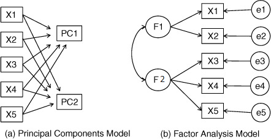

```{r setup, include=FALSE}
knitr::opts_chunk$set(echo = TRUE)
library(tidyr) #the pipe (%>%) tool is extremely useful
library(MASS)
library(ggplot2)
library(kableExtra)
library("gridExtra")
#library(klaR) #visualize lda and qda
library(knitr)
library(corrplot)#for visualizing the corr matrix of the iris data
#install.packages("psych")
library(psych)
```

# Motivating Example
### A Motivating Example:  Exam Score

\tiny
```{r}
exam.cor=rbind(
c(1.000,  0.439,  0.410,  0.288,  0.329,  0.248),
c(0.439,  1.000,  0.351,  0.354,  0.320,  0.329),
c(0.410,  0.351,  1.000,  0.164,  0.190,  0.181),
c(0.288,  0.354,  0.164,  1.000,  0.595,  0.470),
c(0.329,  0.320,  0.190,  0.595,  1.000,  0.464),
c(0.248,  0.329,  0.181,  0.470,  0.464,  1.000))
exam.cov=diag(c(2, 3, 2, 3, 2, 2)) %*%exam.cor %*% diag(c(2, 3, 2, 3, 2, 2))

set.seed(2)
exam=round(mvrnorm(n=60, mu=rep(80,6), Sigma=exam.cov))
colnames(exam)=c("Gaelic",
"English",
"History",
"Arithmetic",
"Algebra",
"Geometry")
exam=data.frame(exam)
```
\normalsize


### Pairwise Correlation

\tiny
```{r, out.width="75%"}
corrplot(cor(exam), method="number")
```
\normalsize


### PCA 

\tiny
```{r}
obj=princomp(exam, cor=TRUE)
obj$loadings
```
\normalsize


### Visualize Eigenvalues 

\tiny
```{r, out.width="60%"}
plot(obj, type="lines", main="Scree Plot")
```
\normalsize


### Visualize First and Second PC (biplot)

\tiny
```{r, out.width="60%"}
biplot(obj, main="Biplot")
```
\normalsize

- How to interpret the results? 


### Introduction to Factor Analysis

```{r, out.width="70%"}

```
https://livebook.manning.com/book/r-in-action-second-edition/chapter-14/6


### PCA vs FA
```{r, out.width="50%", echo=FALSE}

```

- Both reduce dimensionality
- Both use linear combinations
- PCA leads to principal components, which are linear combinations of functions
- FA leads to factors (latent and unobserved)

# The FA Model
### The Factor Model 
- Consider a random vector $\mathbf X \in \mathbb R^p$
- Let $\boldsymbol \mu \in \mathbb R^p$ denote the population mean 
- Let $F\in \mathbb R^m$ denote $m$ factors

$$\mathbf{X} = \left(\begin{array}{c}X_1\\X_2\\\vdots\\X_p\end{array}\right), \boldsymbol{\mu} = \left(\begin{array}{c}\mu_1\\\mu_2\\\vdots\\\mu_p\end{array}\right), \mathbf{F} = \left(\begin{array}{c}f_1\\f_2\\\vdots\\f_m\end{array}\right)$$

 
### The Factor model
- $X_j$, which is observable, is assumed to be a linear function of the unobservable \textcolor{red} {common factors} $f_1, \cdots, f_m$ plus specific errors.
$$\begin{aligned} X_1 & =  \mu_1 + l_{11}f_1 + l_{12}f_2 + \dots + l_{1m}f_m + \epsilon_1\\ X_2 & =  \mu_2 + l_{21}f_1 + l_{22}f_2 + \dots + l_{2m}f_m + \epsilon_2 \\ &  \vdots \\ X_p & =  \mu_p + l_{p1}f_1 + l_{p2}f_2 + \dots + l_{pm}f_m + \epsilon_p \end{aligned}$$
where $\epsilon_j$ is called the specific factor for feature $j$. 
- The means $\mu_1, \cdots, \mu_p$ are parameters
- The coefficients in the factor loading matrix are also parameters


### The Factor model
- Let $\mathbf L$ denote the $p\times m$ matrix of factor loadings
$$\mathbf{L} = \left(\begin{array}{cccc}l_{11}& l_{12}& \dots & l_{1m}\\l_{21} & l_{22} & \dots & l_{2m}\\ \vdots & \vdots & & \vdots \\l_{p1} & l_{p2} & \dots & l_{pm}\end{array}\right) $$
- A compact expression of the factor model is
$$\mathbf X_{p\times 1} = \boldsymbol \mu_{p\times 1} + \mathbf L_{p\times m} \mathbf F_{m\times 1} + \boldsymbol \epsilon_{p\times 1}$$

### Assumptions of FA
- $\mathbf F$ and $\boldsymbol \epsilon$ are uncorrelated
- The common factors are uncorrelated
$$\mathbb E(\mathbf F)=0, Cov(\mathbf F)=\mathbf I$$

- The specific factors are uncorrelated
$$\mathbb E(\boldsymbol\epsilon)=0, Cov(\boldsymbol\epsilon)=\Psi$$
where $\Psi$ is a diagonal matrix with non-negative values, i.e., 

$$\boldsymbol{\Psi} = \left(\begin{array}{cccc}\psi_1 & 0 & \dots & 0 \\ 0 & \psi_2 & \dots & 0 \\ \vdots & \vdots & \ddots & \vdots\\ 0 & 0 & \dots & \psi_p \end{array}\right)$$


### The Covariance
- By the factor model and its assumptions, we have

$$\begin{aligned}
\Sigma&=cov(\mathbf X)\\
&= cov(\mathbf L\mathbf F + \boldsymbol \epsilon)\\
&=\mathbf L Cov(\mathbf F) \mathbf L^T + \Psi\\
&=\mathbf L  \mathbf L^T + \Psi
\end{aligned}
$$
The last step is due to our assumption that $cov(\mathbf F)=\mathbf I$

### The Covariance 
- For $i\not=j$, the covariance between $X_i$ (feature $i$) and $X_j$ (feature $j$) is
$$\sigma_{ij}=cov(X_i, X_j)=\sum_{k=1}^m l_{ik}l_{jk}$$
- The variance of $X_i$ is
$$\sigma_{ii} = \sum_{k=1}^m l_{ik}^2 + \psi_i$$


# Communality

### Communality and Specific Variance

- From last slide
$$\sigma_{ii} = \sum_{k=1}^m l_{ik}^2 + \psi_i$$

- We say that the variance of $X_i$ is partitioned into communality and specific variance where
  - communality is defined as $h_i^2=\sum_{k=1}^m l_{ik}^2$, which is the proportion of variance contributed by common factors 
  - specific variance $\psi_i$, which is the specific variance of $X_i$


### Example

\tiny
```{r}
obj=factanal(exam, factors=2)
L=obj$loadings[,1:2] 
Psi=diag(obj$uniquenesses)
S=diag(sqrt(diag(cov(exam))))
round(cov(exam),2) 
```
\normalsize

### Example

\tiny
```{r}
obj=factanal(exam, factors=2)
L=obj$loadings[,1:2] 
Psi=diag(obj$uniquenesses)
S=diag(sqrt(diag(cov(exam))))
round(cov(exam),2) 
#FA models correlation, L%*%t(L)+ Psi is estimated corr 
round(  S%*% (L%*%t(L))%*% S + S%*%Psi%*%S, 2)
S%*% (L%*%t(L))%*% S
S%*%Psi%*%S
```
\normalsize

- For Geometry, the communality is 2.06 and the specific variance is 2.96. 

# Non-uniqueness 
### Non-uniqueness of Factor Loadings
- The factor loading coefficient is NOT unique. 
- Suppose $\textbf{X} = \boldsymbol{\mu} + \textbf{Lf}+ \boldsymbol{\epsilon}$
- Consider any $m\times m$ orthogonal matrix $\Gamma$, which satisfies $\Gamma \Gamma^T=\Gamma^T \Gamma=\mathbf I$. 
- Let $\tilde {\mathbf L}=L\gamma$
The model $\textbf{X} = \boldsymbol{\mu} + \tilde {\textbf L} \mathbf F+ \boldsymbol{\epsilon}$

give the same $\Sigma$ because 
$$cov(\tilde {\textbf L} \mathbf F)= \tilde {\textbf L} cov (\mathbf F)\tilde {\textbf L}^T=\tilde {\textbf L} \tilde {\textbf L}^T=\mathbf L \mathbf \Gamma \mathbf \Gamma^T \mathbf L^T=\mathbf L \mathbf L^T=cov(\mathbf {LF})$$


### Non-uniqueness of Factor Loadings

\tiny
```{r}
#Estimated Sigma
L%*%t(L) + Psi
```
\normalsize

### Non-uniqueness of Factor Loadings
- Consider a rotation matrix $R$ and define $\tilde {\mathbf L}=L R$

\tiny
```{r}
theta=pi/6
R=matrix(c(cos(theta), sin(theta), -sin(theta), cos(theta)), 2,2)
L.tilde=L%*%R

L.tilde %*% t(L.tilde) + Psi
```
\normalsize


# Computation
## Method 1: Use PCA
- By the spectral decomposition of $\Sigma$ we have
$$\Sigma=\Gamma \Lambda \Gamma^T$$
where $\Gamma=(\gamma_1, \cdots, \gamma_p)$ is an orthogonal matrix and $\Lambda=diag (\lambda_1, \cdots, \lambda_p)$ be the diagonal matrix of eigenvalues. 

- The spectral decomposition can be rewritten to 
$$\boldsymbol \Sigma=\sum_{i=1}^p \lambda_i \gamma_i\gamma_i^T=\sum_{i=1}^p (\sqrt{\lambda_i}\gamma_i)(\sqrt{\lambda_i}\gamma_i)^T$$

## Method 1: Use PCA

- Suppose that $\lambda_m, \lambda_{m+1}, \cdots, 
\lambda_p$ are small. Then 

$$\boldsymbol \Sigma\approx \sum_{i=1}^m (\sqrt{\lambda_i}\gamma_i)(\sqrt{\lambda_i}\gamma_i)^T$$


- Let $\mathbf L=\left(\sqrt{\lambda_1}\gamma_1, \cdots, \sqrt{\lambda_m}\gamma_m\right)$

- Let $\boldsymbol \Psi=\boldsymbol \Sigma-\mathbf L \mathbf L^T$


## Method 2: MLE
- We impose multivariate normality on the common and specific factors

$$\mathbf f\sim N(\mathbf 0, \mathbf I), \epsilon\sim N(\mathbf 0, \Psi)$$

- The log-likelihood is
$$\begin{aligned}
l(\mu,\mathbf L, \Psi) &= - \dfrac{np}{2}\log{2\pi}- \dfrac{n}{2}\log{|\mathbf{LL}^T + \Psi|} -\\ &\dfrac{1}{2}\sum_{i=1}^{n}(\mathbf X_i-\mu)^T(\mathbf L \mathbf L^T+\Psi)^{-1}(\mathbf X_i-\mu)
\end{aligned}$$

where $\mathbf {X}_i\in \mathbb R^p$ denotes the $i$ observation (not the $i$th feature). 


### The Number of Common Factors
- The $p\times p$ covariance matrix $\Sigma$ is symmetric. As a result, there are $\frac{p(p+1)}{2}$ parameters. 
- A factor mode imposes a structure on $\Sigma$
- For a FA model with $m$ common factors
- A FA model a small number common factors, i.e., when $m$ is small, the model uses fewer parameters
  - the model is more parsimonious
  - the model might not be adequate is $m$ is too small
- One can test whether an $m$ is large enough


### Choose $m$ of Factors Computed using PCA
- Cumulatative variance explained is should be reasonably large, such as >$80\%$

- Look for elbow from the scree plot


### A Goodness of Fit Test for the Adequacy of the Number of Common Factors
```{r, out.width="70%"}
knitr::include_graphics("img/TestNumberCommonFactors.png")
```


### Test for the Adequacy of the Number of Common Factors
- The number of parameters for covariance in the full model is 
$$\frac{p(p+1)}{2}$$
- The number of parameters for covariance in the reduced model is
$$mp + p - \frac{m(m-1)}{2}$$

Note: $- \frac{m(m-1)}{2}$ is due to the nonuniqueness of $\mathbf L$. 

- The difference is 

$$\begin{aligned}
df&=\frac{p(p+1)}{2}-[mp+p-\frac{m(m-1)}{2}]\\
&= \frac{1}{2}[(p-m)^2 -p-m]
\end{aligned}$$


### Test for the Adequacy of the Number of Common Factors
- The result indicates that 1 factor might be inadequate as the p-value is small. 

\tiny
```{r}
factanal(exam, factors=1)
```
\normalsize


### Test for the Adequacy of the Number of Common Factors
- The result indicates that 2 factors is adequate becaue the fit is not substantially from the full model. 

\tiny
```{r}
factanal(exam, factors=2)
```
\normalsize


# Factor Rotation
## Rotation for Better Interpretation
- Interpretation of final results are easier for some choices of $\mathbf L$ than others. 
- We often rotate the factors to gain insights or for better interpretation
- This is one advantage of factor analysis
- In practice,
  - Step 1: fit a factor model by imposing conditions that lead to a unique solution
  - Step 2: the loading matrix L is rotated (multiplied by an orthogonal matrix) in a way that gives a good interpretation of the data. Trial and error
- Well know criteria of rotation exist

### Factor Rotation

\tiny
```{r}
principal(exam, nfactors=2)
```
\normalsize


### Factor Rotation

\tiny
```{r, out.width="70%"}
plot(principal(exam, nfactors=2))
```
\normalsize


### Factor Rotation

\tiny
```{r}
principal(exam,nfactors=2, rotate="none")
```
\normalsize


### Factor Rotation

\tiny
```{r, out.width="70%"}
plot(principal(exam,nfactors=2, rotate="none"))
```
\normalsize

### Factor Rotation

\tiny
```{r}
principal(exam,nfactors=2, rotate="promax")
```
\normalsize


### Factor Rotation

\tiny
```{r, out.width="70%"}
plot(principal(exam,nfactors=2, rotate="promax"))
```
\normalsize


# Confirmatory FA

### Exploratory or Confirmatory Factor Analysis
- Exploratory Factory Analysis (EFA)
- The FA approach we have discussed is exploratory in nature. 
- In fact, we can perform EFA and identify latent factors by using only correlations, not the data
- The purpose of EFA is to explore the possible underlying structure that can explain the observed correlations
- EFA is used when researchers do not have a specific idea about the underlying structure of data
- EFA is hypothesis-generating
  
  
### Exploratory or Confirmatory Factor Analysis
- Confirmatory Factory Analysis (EFA) is used when a researcher has specific hypotheses or theories about the factor structure of their data.
- It is a "theory-driven" approach.
- In CFA, the researcher specifies the number of factors and which variables load onto which factors.
- CFA is typically used in later stages of research to test or confirm the factor structure suggested by EFA  
- CFA is hypothesis testing. A pre-specified model is required

  
### Exploratory or Confirmatory Factor Analysis
  
- Use EFA when:
  - You are unsure about the underlying structure.
  - You aim to uncover complex patterns.
  - You need to form hypotheses and develop theory.
- Use CFA when:
  - You have a predetermined theory or model.
  - You aim to test the hypothesis about the factor structure.
  - You need to confirm or disconfirm theories.


